# Etapa EX (Execute)

## Descripción General

La etapa EX (Execute) es la tercera etapa del pipeline MIPS. Su función principal es ejecutar las operaciones aritméticas y lógicas, manejar el forwarding de datos para evitar hazards, y preparar los datos para la etapa de memoria.

## Arquitectura del Módulo

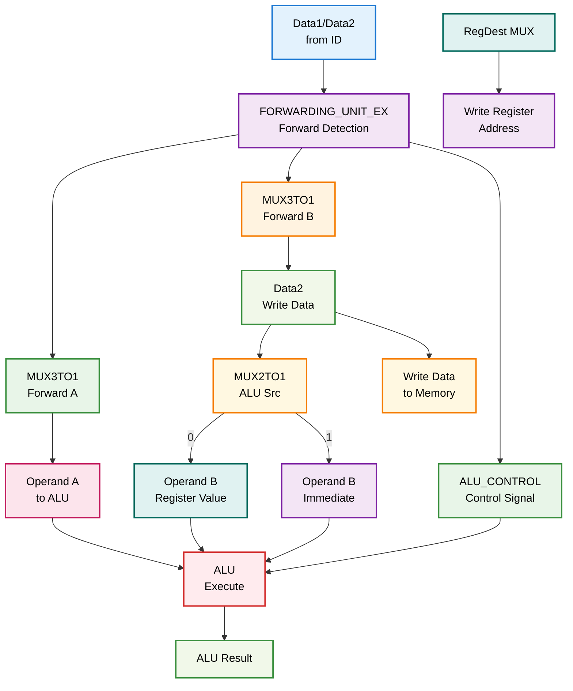

## Módulos Componentes

### 1. ALU.v - Unidad Aritmético-Lógica

**Descripción**: Ejecuta todas las operaciones aritméticas y lógicas del procesador.

**Operaciones Soportadas**:
- **Aritméticas**: ADD, SUB, MULT, MULTU
- **Lógicas**: AND, OR, XOR, NOR
- **Desplazamientos**: SLL, SRL, SRA, SLLV, SRLV, SRAV
- **Comparaciones**: SLT, SLTU

**Interfaces**:
```verilog
module ALU(
    input wire [31:0] data_a,
    input wire [31:0] data_b,
    input wire [5:0] operation,
    output reg [31:0] result,
    output reg zero_flag
);
```

**Diagrama de Operaciones**:
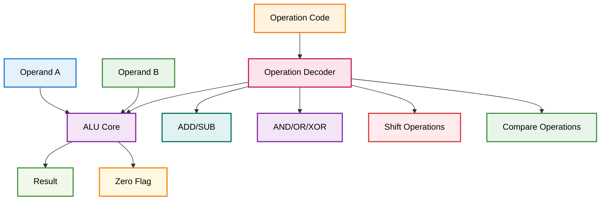

### 2. ALU_CONTROL.v - Control de la ALU

**Descripción**: Genera las señales de control específicas para la ALU basándose en ALUOp y function code.

**Funcionalidades**:
- Decodificación de ALUOp
- Generación de señales de control específicas
- Soporte para todas las operaciones MIPS

**Interfaces**:
```verilog
module ALU_CONTROL(
    input wire [3:0] alu_op,
    input wire [5:0] function_code,
    output reg [5:0] alu_control
);
```

**Diagrama de Control**:
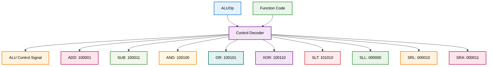

### 3. FORWARDING_UNIT_EX.v - Unidad de Forwarding

**Descripción**: Detecta y maneja el forwarding de datos para evitar hazards RAW.

**Funcionalidades**:
- Detección de hazards de datos
- Forwarding desde EX/MEM
- Forwarding desde MEM/WB
- Control de multiplexores de forwarding

**Interfaces**:
```verilog
module FORWARDING_UNIT_EX(
    input wire [4:0] id_ex_rs,
    input wire [4:0] id_ex_rt,
    input wire [4:0] ex_mem_rd,
    input wire [4:0] mem_wb_rd,
    input wire ex_mem_reg_write,
    input wire mem_wb_reg_write,
    output reg [1:0] forward_a,
    output reg [1:0] forward_b
);
```

**Diagrama de Forwarding**:
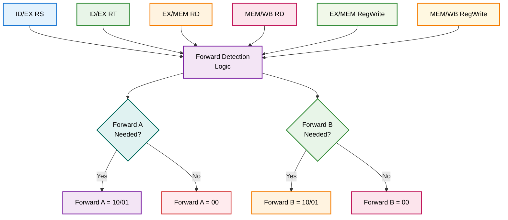

### 4. MUX3TO1.v - Multiplexor 3:1

**Descripción**: Multiplexor de 3 entradas para selección de operandos con forwarding.

**Funcionalidad**:
- Selección entre valor original, EX/MEM, y MEM/WB
- Control de forwarding de datos

**Interfaces**:
```verilog
module MUX3TO1(
    input wire [31:0] input_1,
    input wire [31:0] input_2,
    input wire [31:0] input_3,
    input wire [1:0] selection_bit,
    output reg [31:0] mux
);
```

**Diagrama de Selección**:
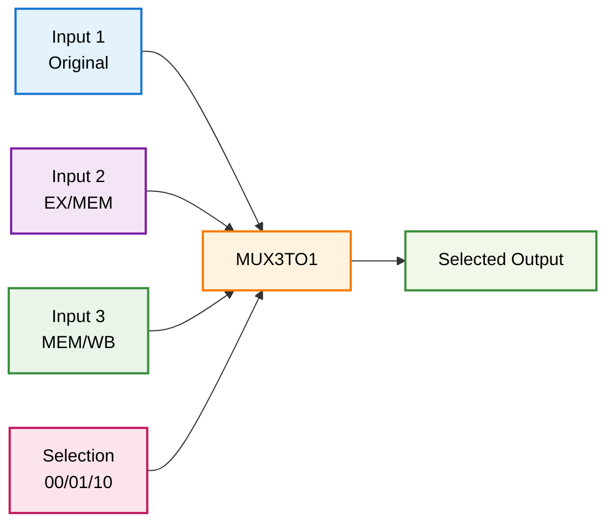

### 5. MUX2TO1_EX.v - Multiplexor 2:1

**Descripción**: Multiplexor de 2 entradas para selección de registro destino.

**Funcionalidad**:
- Selección entre RT y RD para registro destino
- Control de RegDest

**Interfaces**:
```verilog
module MUX2TO1_EX(
    input wire [4:0] input_1,
    input wire [4:0] input_2,
    input wire selection_bit,
    output reg [4:0] mux
);
```

## Flujo de Datos Detallado

### Ejecución de Instrucción R-Type
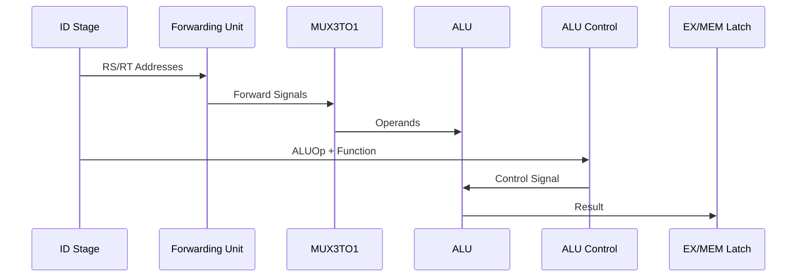

### Ejecución de Instrucción I-Type
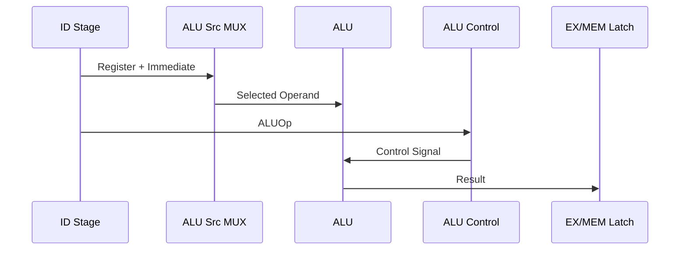

### Forwarding de Datos
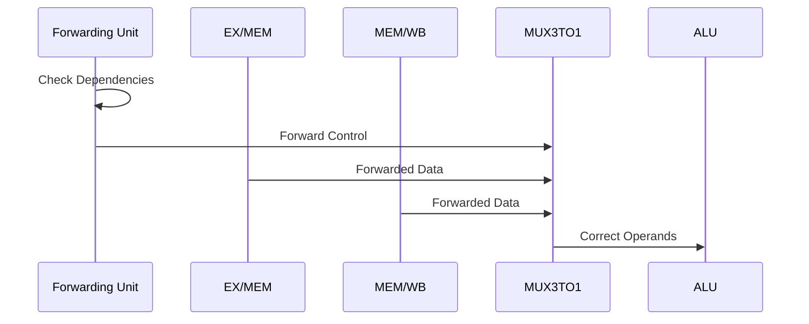

## Tipos de Operaciones

### Operaciones Aritméticas
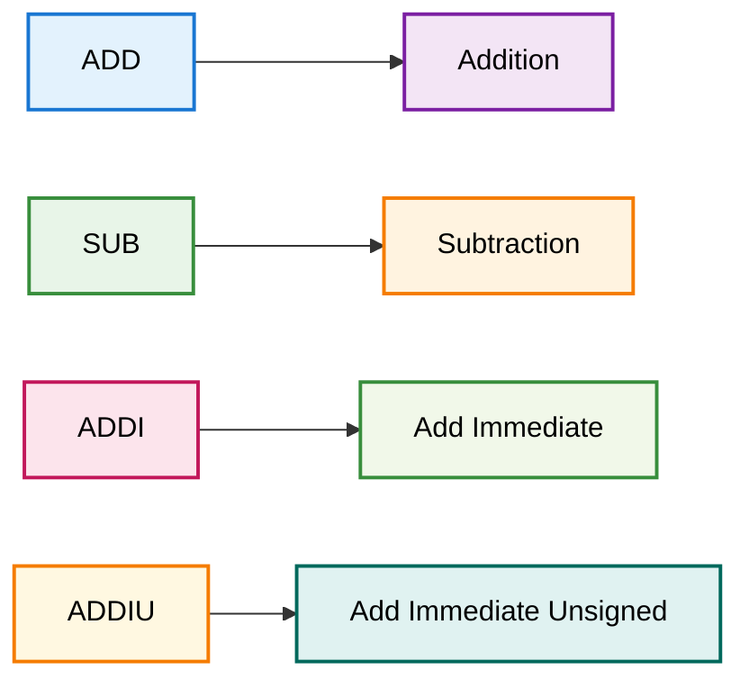

### Operaciones Lógicas
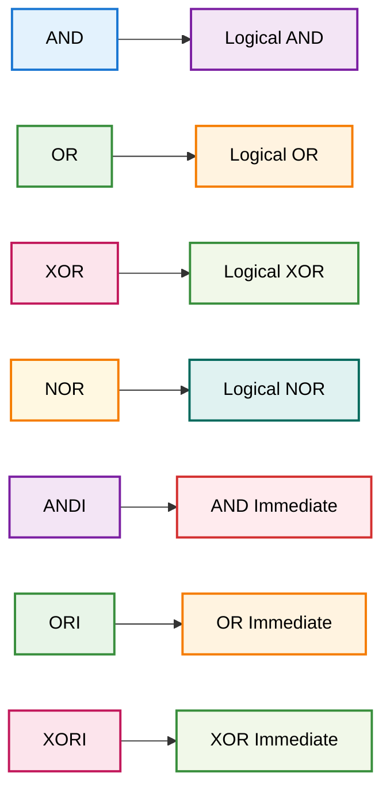

### Operaciones de Desplazamiento
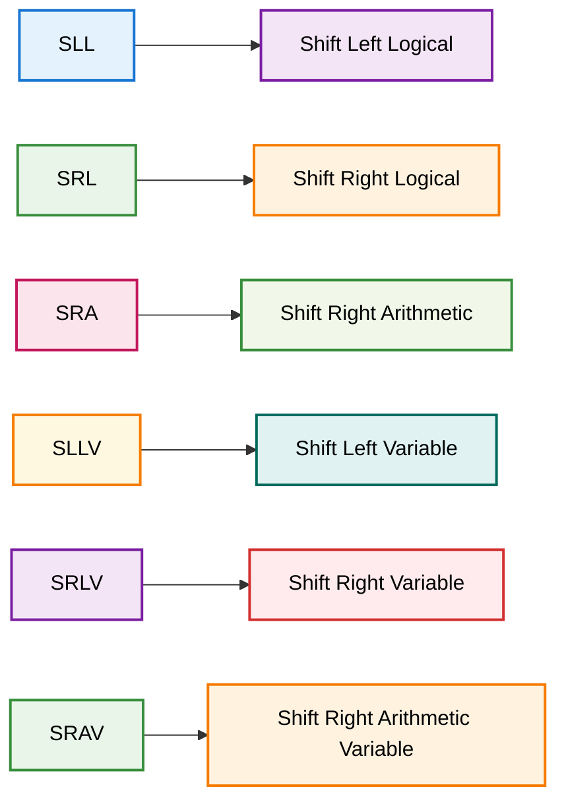

### Operaciones de Comparación
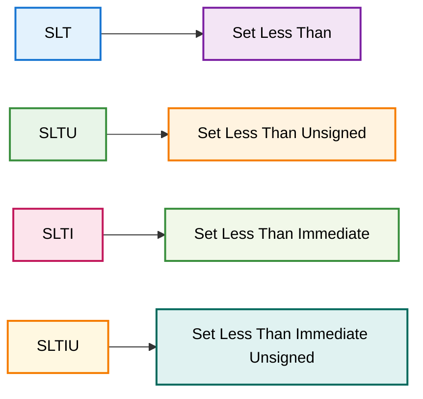

## Forwarding y Hazards

### Detección de Forwarding
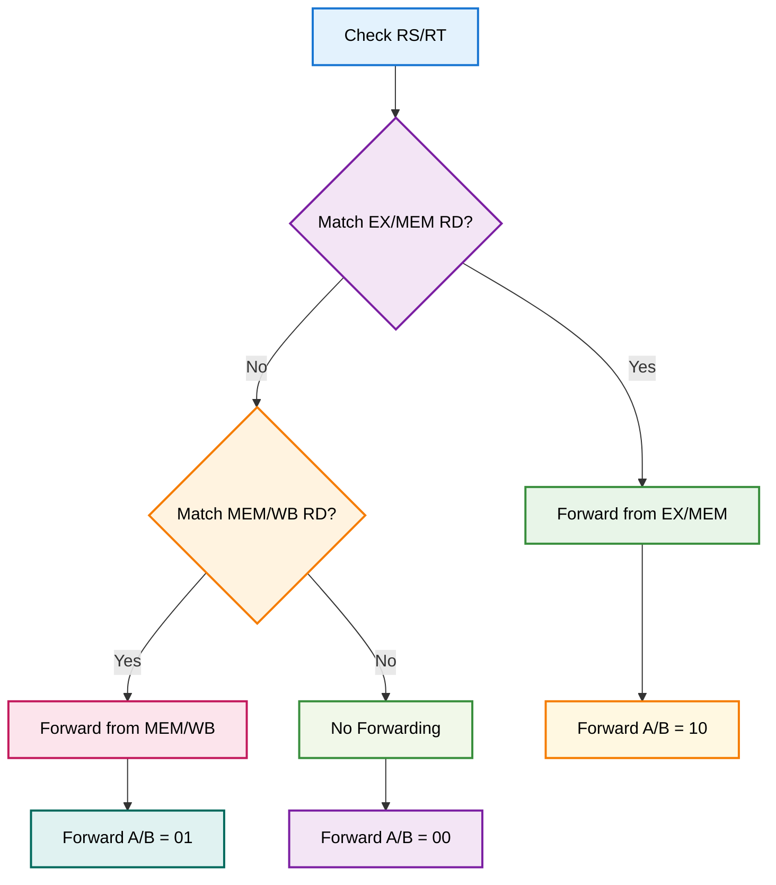

### Casos de Forwarding
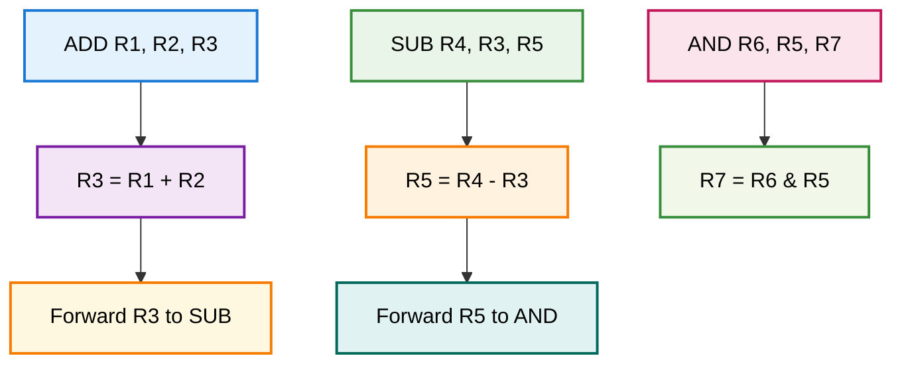

## Timing y Latencia

### Timing Diagram
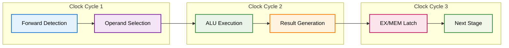

## Optimizaciones Implementadas

### 1. Forwarding Optimizado
- Detección temprana de hazards
- Forwarding desde múltiples etapas
- Mínimo overhead de latencia

### 2. ALU Optimizada
- Operaciones combinacionales rápidas
- Soporte para todas las instrucciones MIPS
- Flags de condición eficientes

### 3. Control de Hazards
- Forwarding automático
- Detección de dependencias
- Resolución sin stall

## Casos Especiales

### 1. Load-Use Hazard
```mermaid
graph TD
    A[LW R1, 100(R2)] --> B[Load from Memory]
    C[ADD R3, R1, R4] --> D[Use Loaded Value]
    
    B --> E[Stall Required]
    E --> F[Forward from MEM/WB]
    
    style A fill:#ffebee,stroke:#d32f2f,stroke-width:2px,color:#000
    style B fill:#fff3e0,stroke:#f57c00,stroke-width:2px,color:#000
    style C fill:#fce4ec,stroke:#c2185b,stroke-width:2px,color:#000
    style D fill:#f1f8e9,stroke:#388e3c,stroke-width:2px,color:#000
    style E fill:#e8f5e8,stroke:#388e3c,stroke-width:2px,color:#000
    style F fill:#f3e5f5,stroke:#7b1fa2,stroke-width:2px,color:#000
```

### 2. Branch Hazard
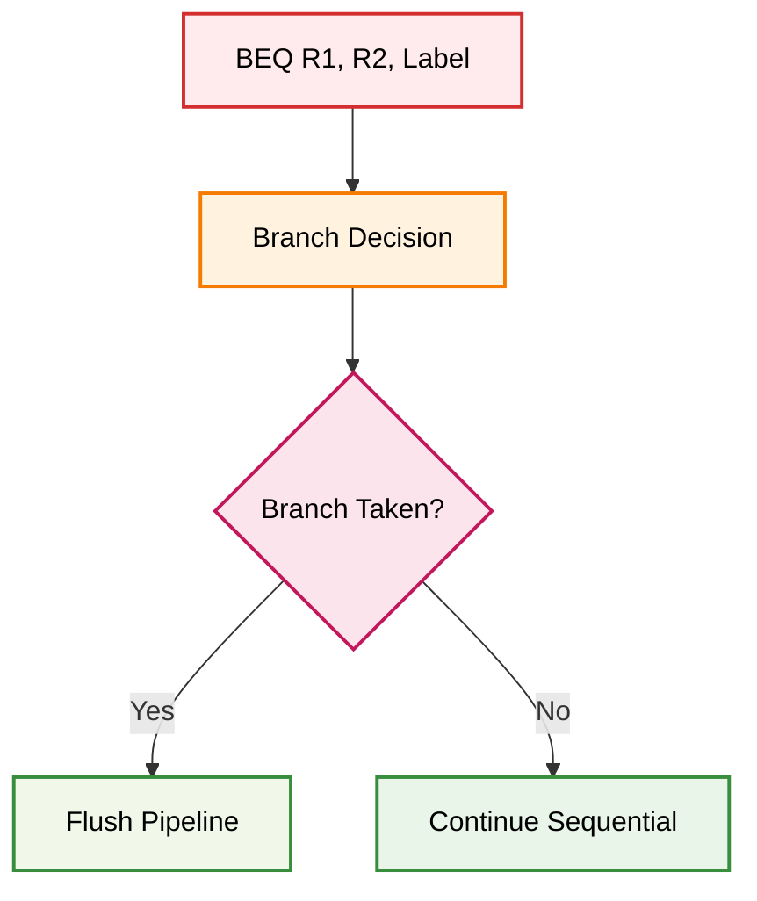

## Integración con Debug Unit

La etapa EX se integra con la debug unit para permitir:
- Monitoreo de operandos y resultados
- Verificación de forwarding
- Debug de operaciones ALU
- Control de ejecución

## Archivos Relacionados

- `EX.v`: Módulo principal de la etapa
- `ALU.v`: Unidad Aritmético-Lógica
- `ALU_CONTROL.v`: Control de la ALU
- `FORWARDING_UNIT_EX.v`: Unidad de forwarding
- `MUX2TO1_EX.v`: Multiplexor 2:1
- `MUX3TO1.v`: Multiplexor 3:1
- `EX_MEM.v`: Registro de segmentación
- `testbenchs/ex_test.v`: Testbench de la etapa 