# Etapa ID (Instruction Decode)

## Descripción General

La etapa ID (Instruction Decode) es la segunda etapa del pipeline MIPS. Su función principal es decodificar la instrucción, leer los operandos del banco de registros, generar las señales de control, y detectar hazards de datos.

## Arquitectura del Módulo


## Módulos Componentes

### 1. CONTROL_UNIT.v - Unidad de Control

**Descripción**: Genera todas las señales de control basadas en el opcode de la instrucción.

**Funcionalidades**:
- Decodificación del opcode
- Generación de señales de control
- Soporte para todas las instrucciones MIPS
- Control de memoria y registros

**Interfaces**:
```verilog
module CONTROL_UNIT(
    input wire enable,
    input wire [5:0] op_code,
    output reg branch,
    output reg is_beq,
    output reg reg_dest,
    output reg alu_src,
    output reg [3:0] alu_op,
    output reg mem_read,
    output reg mem_write,
    output reg mem_to_reg,
    output reg reg_write,
    output reg jump,
    output reg [2:0] bhw_type,
    output reg halt
);
```

**Diagrama de Decodificación**:


### 2. REGMEM.v - Banco de Registros

**Descripción**: Banco de 32 registros de propósito general con soporte para debug.

**Características**:
- 32 registros de 32 bits
- Lectura de 2 puertos
- Escritura de 1 puerto
- Forwarding desde WB
- Acceso para debug unit

**Interfaces**:
```verilog
module REGMEM(
    input wire clk,
    input wire reset,
    input wire [4:0] rs,
    input wire [4:0] rt,
    input wire [31:0] write_data,
    input wire [4:0] reg_addr,
    input wire write_enable,
    input wire [4:0] du_reg_addr,
    output wire [31:0] du_reg_data,
    output wire [31:0] data_1,
    output wire [31:0] data_2
);
```

**Diagrama del Banco de Registros**:


### 3. HAZARD_UNIT.v - Detección de Hazards

**Descripción**: Detecta hazards de datos y genera señales de stall.

**Funcionalidades**:
- Detección de hazards RAW (Read After Write)
- Generación de señales de stall
- Control de forwarding
- Prevención de hazards de control

**Interfaces**:
```verilog
module HAZARD_UNIT(
    input wire branch,
    input wire [4:0] if_id_rs,
    input wire [4:0] if_id_rt,
    input wire [4:0] id_ex_rt,
    input wire id_ex_mem_read,
    output reg flush_idex,
    output reg stall
);
```

**Diagrama de Detección de Hazards**:


### 4. FORWARDING_UNIT_ID.v - Forwarding para ID

**Descripción**: Detecta la necesidad de forwarding para instrucciones BEQ.

**Funcionalidad**:
- Forwarding desde EX/MEM para BEQ
- Forwarding desde MEM/WB para BEQ
- Comparación de registros

**Interfaces**:
```verilog
module FORWARDING_UNIT_ID(
    input wire [4:0] if_id_rs,
    input wire [4:0] if_id_rt,
    input wire [4:0] ex_m_rd,
    input wire [4:0] m_wb_rd,
    input wire ex_m_reg_write,
    input wire m_wb_reg_write,
    output reg forward_a,
    output reg forward_b
);
```

### 5. SIGN_EXTEND.v - Extensión de Signo

**Descripción**: Extiende el inmediato de 16 bits a 32 bits.

**Funcionalidad**:
- Extensión de signo para inmediatos
- Soporte para instrucciones I-type

**Interfaces**:
```verilog
module SIGN_EXTEND(
    input wire [15:0] immediate,
    output wire [31:0] extended_immediate
);
```

### 6. SHFT2L_ID.v - Desplazamiento para BEQ

**Descripción**: Calcula la dirección de salto para instrucciones BEQ.

**Funcionalidad**:
- Desplazamiento a la izquierda de 2 bits
- Suma con PC+4

**Interfaces**:
```verilog
module SHFT2L_ID(
    input wire [31:0] extended_offset,
    output wire [31:0] branch_address
);
```

### 7. COMPARATOR.V - Comparador para BEQ

**Descripción**: Compara dos valores para determinar si se debe tomar el salto.

**Funcionalidad**:
- Comparación de igualdad
- Generación de señal de salto

**Interfaces**:
```verilog
module COMPARATOR(
    input wire [31:0] data_1,
    input wire [31:0] data_2,
    output wire equal
);
```

## Flujo de Datos Detallado

### Decodificación de Instrucción R-Type


### Decodificación de Instrucción I-Type


### Detección de Hazard


## Tipos de Instrucciones Soportadas

### R-Type Instructions


### I-Type Instructions


### J-Type Instructions


## Señales de Control Generadas

### Señales de Control Principales


## Hazards y su Resolución

### Tipos de Hazards


### Resolución de Hazards

```mermaid
graph TD
    A[Detect Hazard] --> B{Type?}
    B -->|Data| C[Forwarding]
    B -->|Control| D[Stall + Flush]
    B -->|Structural| E[Stall]
    
    C --> F[Forward from EX/MEM]
    C --> G[Forward from MEM/WB]
    
    D --> H[Stall IF Stage]
    D --> I[Flush ID/EX]
    
    E --> J[Wait for Resource]
    
    style A fill:#ffebee,stroke:#d32f2f,stroke-width:2px,color:#000
    style B fill:#fff3e0,stroke:#f57c00,stroke-width:2px,color:#000
    style C fill:#fce4ec,stroke:#c2185b,stroke-width:2px,color:#000
    style D fill:#f1f8e9,stroke:#388e3c,stroke-width:2px,color:#000
    style E fill:#e8f5e8,stroke:#388e3c,stroke-width:2px,color:#000
    style F fill:#f3e5f5,stroke:#7b1fa2,stroke-width:2px,color:#000
    style G fill:#e3f2fd,stroke:#1976d2,stroke-width:2px,color:#000
    style H fill:#fff8e1,stroke:#f57c00,stroke-width:2px,color:#000
    style I fill:#e0f2f1,stroke:#00695c,stroke-width:2px,color:#000
    style J fill:#f3e5f5,stroke:#7b1fa2,stroke-width:2px,color:#000
```


## Timing y Latencia

### Timing Diagram


## Integración con Debug Unit

La etapa ID se integra con la debug unit para permitir:
- Lectura de registros vía UART
- Monitoreo de valores de registros
- Verificación de señales de control
- Debug de hazards

## Archivos Relacionados

- `ID.v`: Módulo principal de la etapa
- `CONTROL_UNIT.v`: Unidad de control
- `REGMEM.v`: Banco de registros
- `HAZARD_UNIT.v`: Detección de hazards
- `FORWARDING_UNIT_ID.v`: Forwarding para ID
- `SIGN_EXTEND.v`: Extensión de signo
- `SHFT2L_ID.v`: Desplazamiento para BEQ
- `COMPARATOR.V`: Comparador para BEQ
- `AND_ID.v`: Compuerta AND
- `ID_EX.v`: Registro de segmentación
- `testbenchs/id_test.v`: Testbench de la etapa 