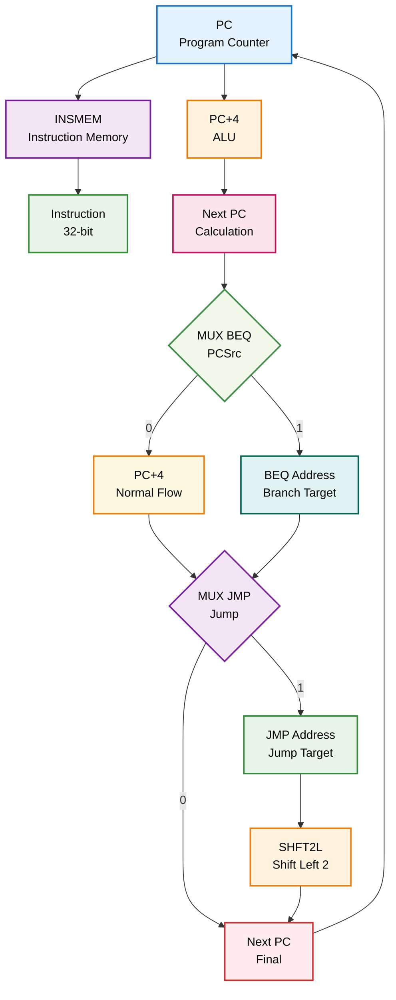
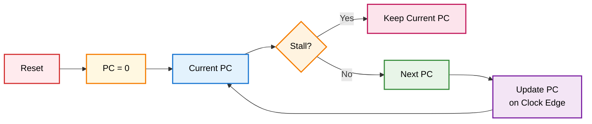
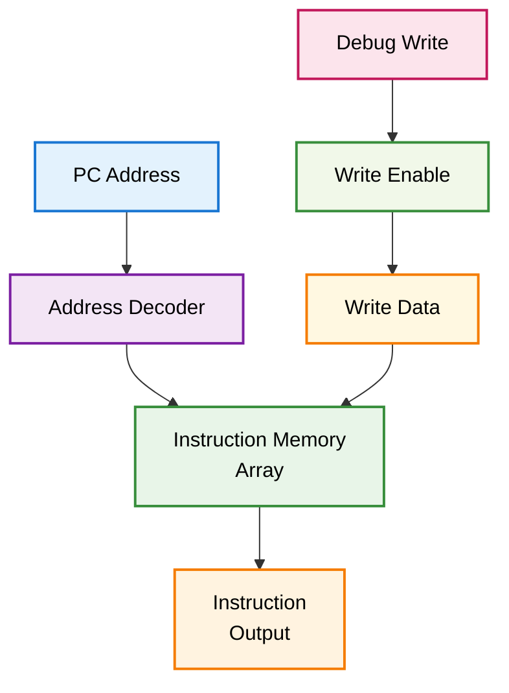
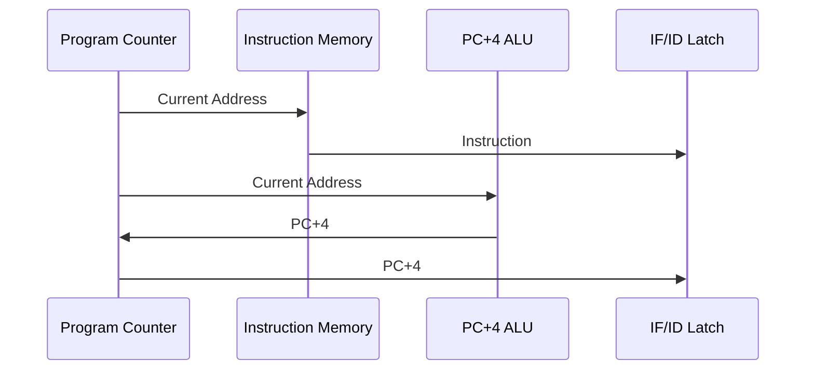
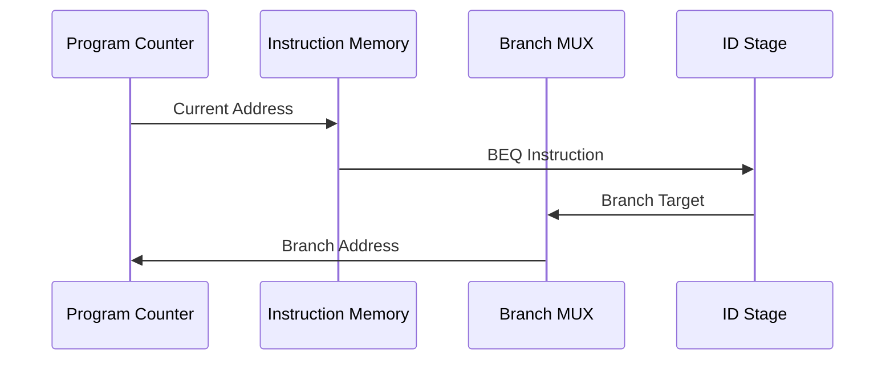
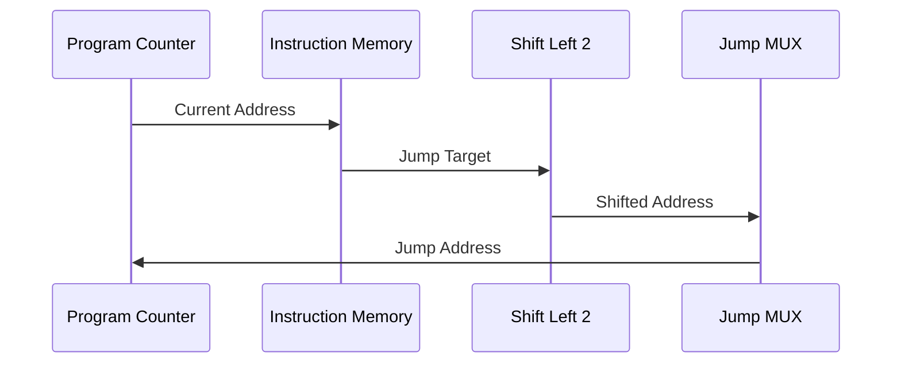
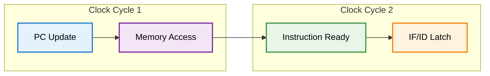
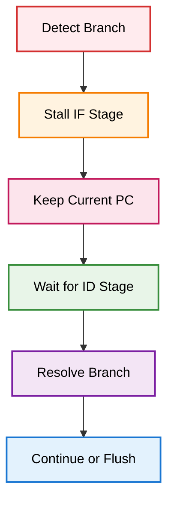
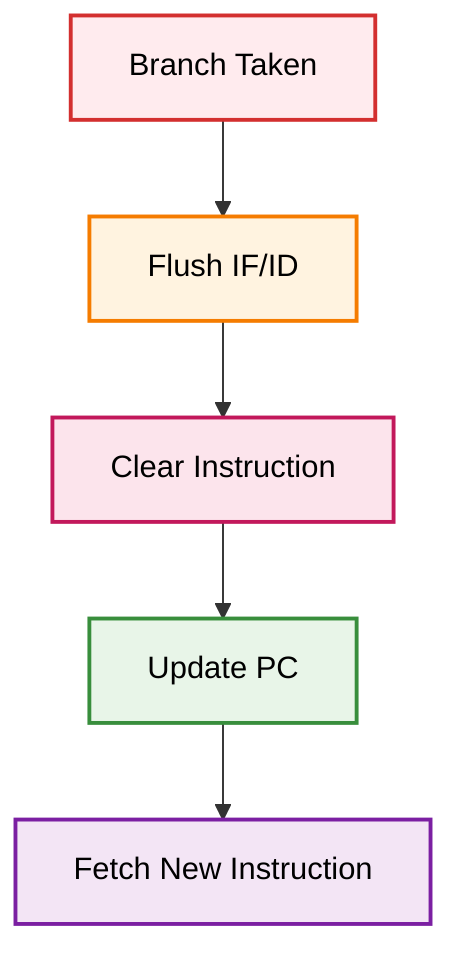

# Etapa IF (Instruction Fetch)

## Descripción General

La etapa IF (Instruction Fetch) es la primera etapa del pipeline MIPS. Su función principal es obtener la siguiente instrucción de la memoria de instrucciones y calcular la dirección de la siguiente instrucción (PC+4).

## Arquitectura del Módulo



## Módulos Componentes

### 1. PC.v - Contador de Programa

**Descripción**: Registro que mantiene la dirección de la instrucción actual.

**Funcionalidades**:
- Almacena la dirección de la instrucción actual
- Se actualiza cada ciclo de reloj
- Soporta stall para hazards
- Reset asíncrono

**Interfaces**:
```verilog
module PC(
    input wire clk,
    input wire reset,
    input wire [31:0] next_pc,
    input wire write_en,
    input wire stall,
    output reg [31:0] pc
);
```

**Diagrama de Funcionamiento**:


### 2. INSMEM.v - Memoria de Instrucciones

**Descripción**: Memoria ROM que almacena las instrucciones del programa.

**Características**:
- Memoria de solo lectura
- Direccionamiento por palabra (32 bits)
- Capacidad configurable
- Soporte para debug unit

**Interfaces**:
```verilog
module INSMEM(
    input wire clk,
    input wire reset,
    input wire write_en,
    input wire read_en,
    input wire [31:0] data,
    input wire [31:0] addr,
    input wire [31:0] addr_wr,
    output reg [31:0] instruction
);
```

**Diagrama de Memoria**:


### 3. SHFT2L.v - Desplazamiento para Saltos

**Descripción**: Módulo que realiza el desplazamiento a la izquierda de 2 bits para instrucciones de salto.

**Funcionalidad**:
- Toma los 26 bits de dirección de salto
- Los desplaza 2 posiciones a la izquierda
- Concatena con los 4 bits superiores del PC

**Interfaces**:
```verilog
module SHFT2L(
    input wire [3:0] pc_plus_4,
    input wire [25:0] shift,
    output wire [31:0] jump_dir
);
```

**Diagrama de Desplazamiento**:
```mermaid
graph LR
    A[PC+4[31:28]] --> C[Concat]
    B[Instruction[25:0]] --> D[Shift Left 2]
    D --> E[26 bits shifted]
    C --> F[Jump Address<br/>32 bits]
    E --> C
    
    style A fill:#e3f2fd,stroke:#1976d2,stroke-width:2px,color:#000
    style B fill:#f3e5f5,stroke:#7b1fa2,stroke-width:2px,color:#000
    style C fill:#e8f5e8,stroke:#388e3c,stroke-width:2px,color:#000
    style D fill:#fff3e0,stroke:#f57c00,stroke-width:2px,color:#000
    style E fill:#fce4ec,stroke:#c2185b,stroke-width:2px,color:#000
    style F fill:#f1f8e9,stroke:#388e3c,stroke-width:2px,color:#000
```

## Flujo de Datos Detallado

### Ciclo Normal (Sin Saltos)


### Ciclo con Salto Condicional (BEQ)


### Ciclo con Salto Incondicional (JMP)


## Señales de Control

### Entradas
- `i_clk`: Reloj del sistema
- `i_reset`: Señal de reset asíncrono
- `i_stall`: Señal de stall para hazards
- `i_pcsrc`: Selección de dirección (PC+4 o BEQ)
- `i_jump`: Señal de salto incondicional
- `i_beq_dir`: Dirección de salto para BEQ

### Salidas
- `o_pc_plus_4`: PC + 4
- `o_instruction`: Instrucción leída de memoria

## Timing y Latencia

### Timing Diagram


### Latencia
- **Acceso a memoria**: 1 ciclo de reloj
- **Cálculo PC+4**: Combinacional
- **Desplazamiento**: Combinacional
- **Total**: 1 ciclo de reloj

## Casos Especiales

### 1. Hazard de Control (Stall)


### 2. Flush del Pipeline


## Optimizaciones Implementadas

### 1. Predicción de Saltos
- Predicción estática: "not taken"
- Flush cuando predicción es incorrecta

### 2. Memoria de Instrucciones Optimizada
- Acceso directo sin latencia adicional
- Soporte para debug unit

### 3. Control de Hazards
- Stall automático para hazards de control
- Flush para saltos tomados

## Testbench y Verificación

### Casos de Prueba
1. **Secuencia normal**: PC incrementa secuencialmente
2. **Salto condicional**: BEQ con condición verdadera
3. **Salto incondicional**: JMP a dirección específica
4. **Stall**: Verificación de stall por hazard
5. **Reset**: Comportamiento después de reset

### Métricas de Rendimiento
- **Throughput**: 1 instrucción por ciclo (sin hazards)
- **Latencia**: 1 ciclo de reloj
- **Overhead de stall**: Mínimo

## Integración con Debug Unit

La etapa IF se integra con la debug unit para permitir:
- Carga de instrucciones vía UART
- Monitoreo del PC actual
- Control de ejecución (run/stop)
- Lectura de instrucciones en memoria

## Archivos Relacionados

- `IF.v`: Módulo principal de la etapa
- `PC.v`: Contador de programa
- `INSMEM.v`: Memoria de instrucciones
- `SHFT2L.v`: Desplazamiento para saltos
- `IF_ID.v`: Registro de segmentación
- `testbenchs/if_test.v`: Testbench de la etapa 