# Etapa MEM (Memory)

## Descripción General

La etapa MEM (Memory) es la cuarta etapa del pipeline MIPS. Su función principal es acceder a la memoria de datos para operaciones de load y store, y preparar los datos para la etapa de write back.

## Arquitectura del Módulo

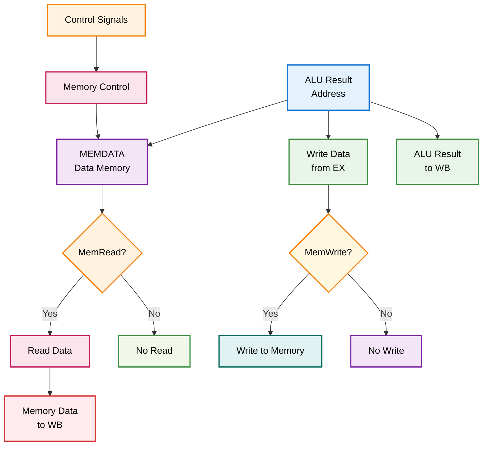

## Módulos Componentes

### 1. MEMDATA.v - Memoria de Datos

**Descripción**: Memoria RAM que almacena los datos del programa.

**Características**:
- Memoria de lectura/escritura
- Direccionamiento por palabra (32 bits)
- Soporte para byte, halfword y word
- Acceso para debug unit

**Interfaces**:
```verilog
module MEMDATA(
    input wire clk,
    input wire reset,
    input wire [31:0] address,
    input wire [31:0] write_data,
    input wire mem_read,
    input wire mem_write,
    input wire [2:0] bhw_type,
    output reg [31:0] read_data
);
```

**Diagrama de Memoria**:
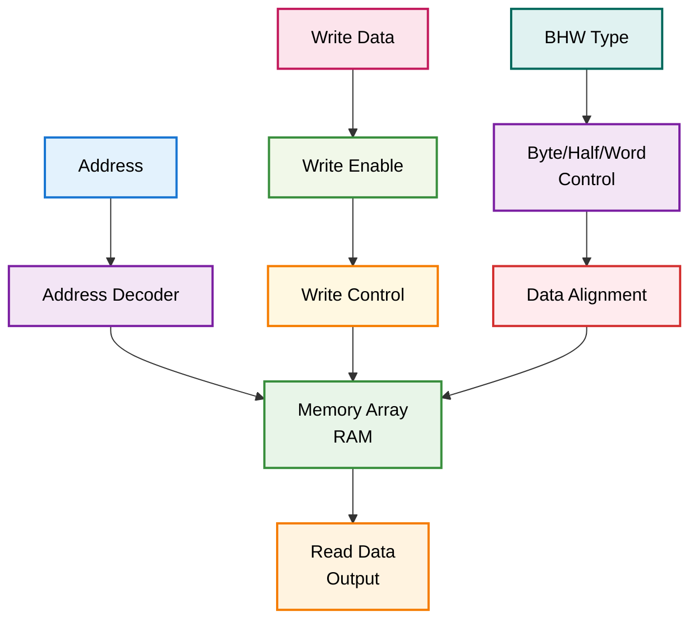

### 2. MEM.v - Controlador de Memoria

**Descripción**: Módulo principal que controla las operaciones de memoria.

**Funcionalidades**:
- Control de operaciones de memoria
- Manejo de señales de control
- Preparación de datos para WB
- Integración con debug unit

**Interfaces**:
```verilog
module MEM(
    input wire clk,
    input wire reset,
    input wire [31:0] alu_result,
    input wire [31:0] write_data,
    input wire [4:0] rd,
    input wire mem_read,
    input wire mem_write,
    input wire mem_to_reg,
    input wire reg_write,
    input wire [2:0] bhw_type,
    input wire [4:0] du_mem_addr,
    output wire [31:0] read_data,
    output wire [31:0] alu_result_out,
    output wire [4:0] rd_out,
    output wire mem_to_reg_out,
    output wire reg_write_out,
    output wire [31:0] du_mem_data
);
```

**Diagrama de Control**:
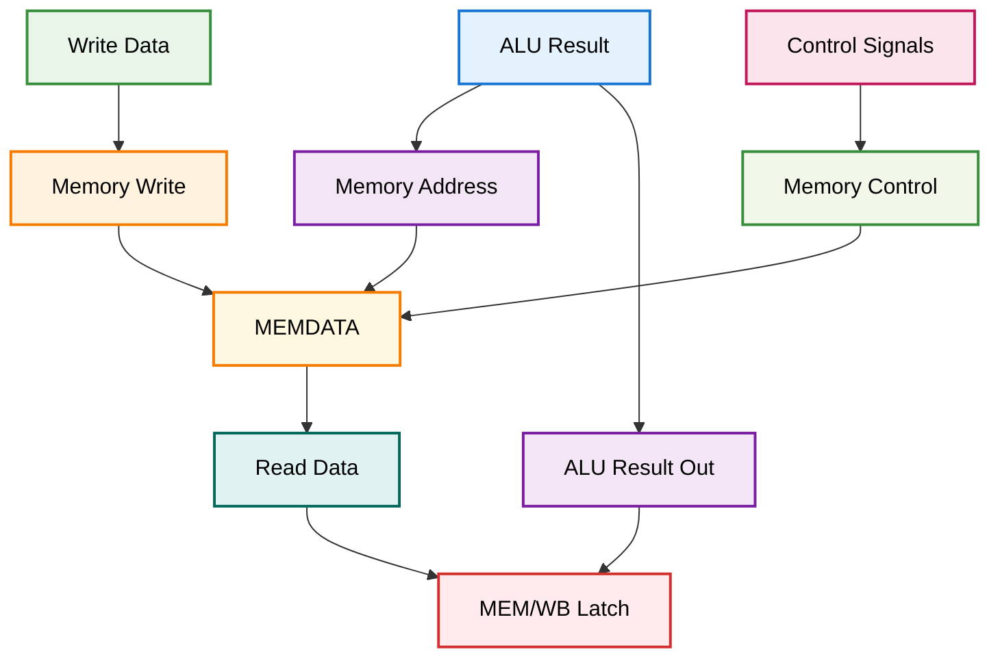

## Tipos de Operaciones de Memoria

### Load Operations (Lectura)
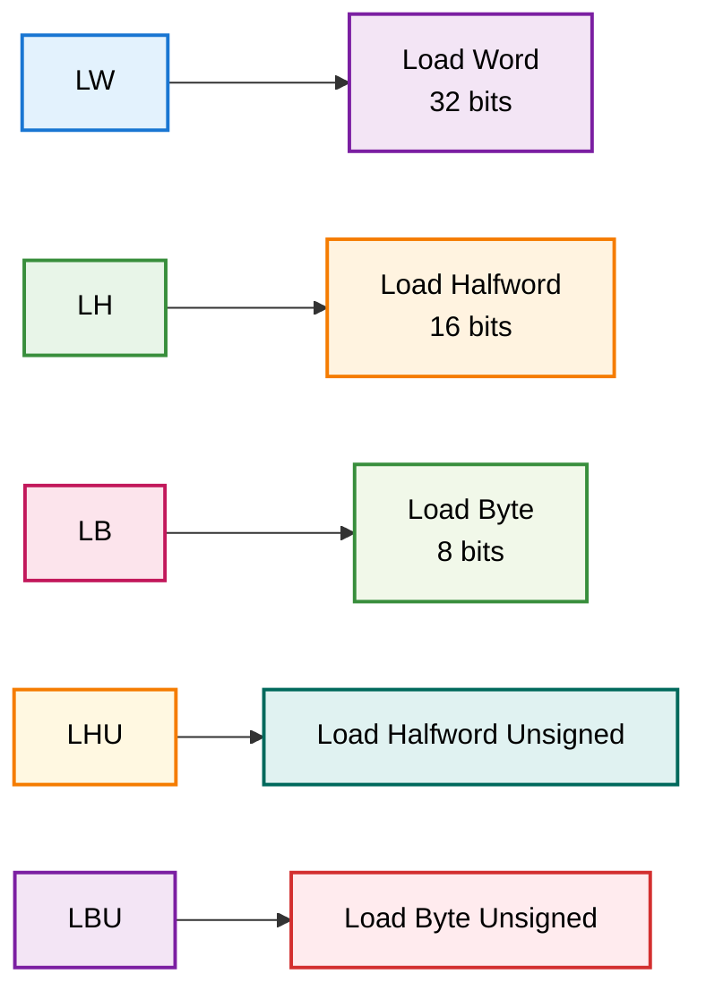

### Store Operations (Escritura)
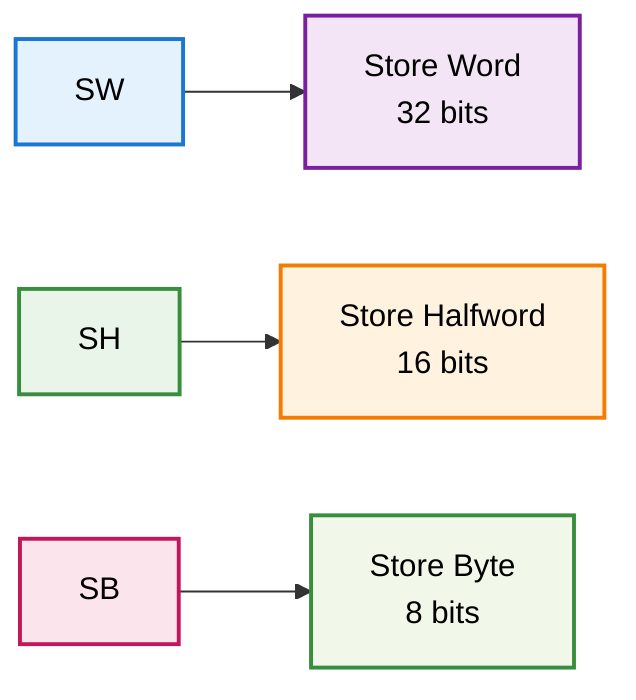

## Flujo de Datos Detallado

### Operación Load (LW)
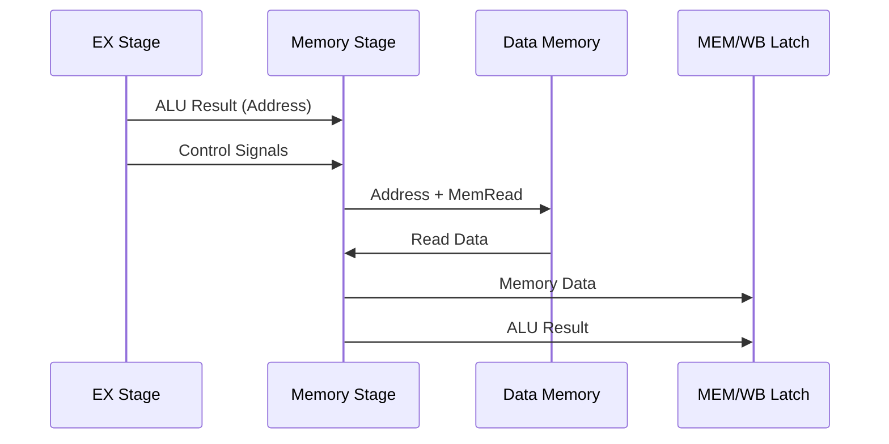

### Operación Store (SW)
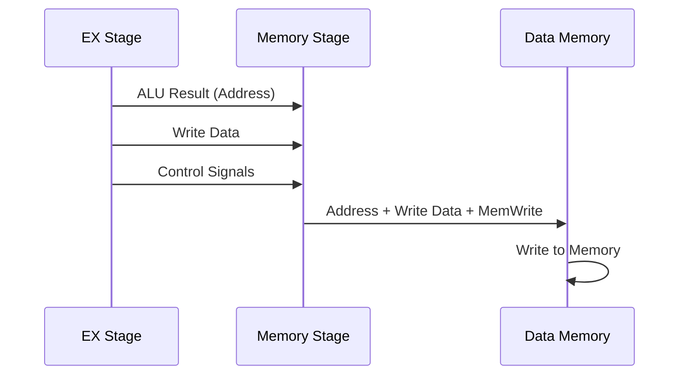

### Operación sin Memoria
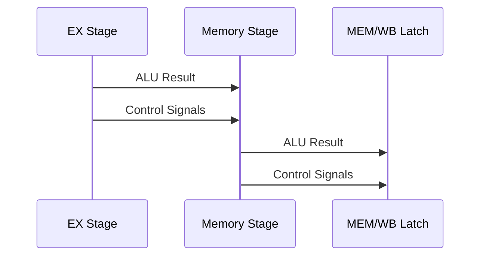

## Alineación de Datos

### Alineación de Bytes
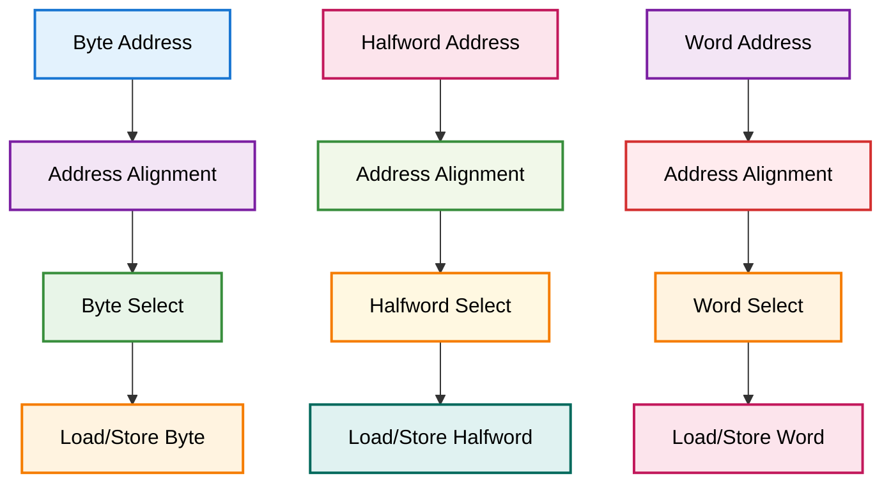

## Señales de Control

### Señales de Entrada
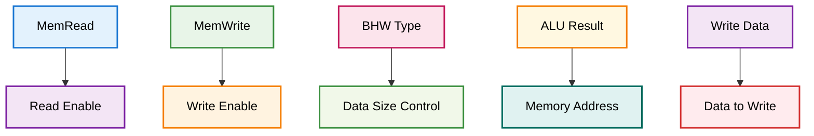

### Señales de Salida
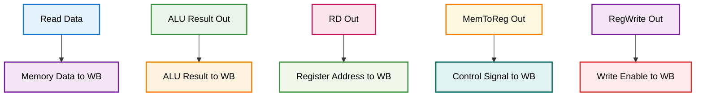

## Timing y Latencia

### Timing Diagram
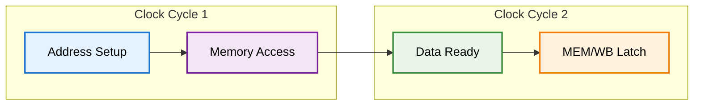

### Latencia de Memoria
- **Acceso a memoria**: 1 ciclo de reloj
- **Operaciones combinacionales**: Sin latencia adicional
- **Total**: 1 ciclo de reloj

## Casos Especiales

### 1. Load-Use Hazard
```mermaid
graph TD
    A[LW R1, 100(R2)] --> B[Load from Memory]
    C[ADD R3, R1, R4] --> D[Use Loaded Value]
    
    B --> E[Stall Required]
    E --> F[Forward from MEM/WB]
    
    style A fill:#ffebee,stroke:#d32f2f,stroke-width:2px,color:#000
    style B fill:#fff3e0,stroke:#f57c00,stroke-width:2px,color:#000
    style C fill:#fce4ec,stroke:#c2185b,stroke-width:2px,color:#000
    style D fill:#f1f8e9,stroke:#388e3c,stroke-width:2px,color:#000
    style E fill:#e8f5e8,stroke:#388e3c,stroke-width:2px,color:#000
    style F fill:#f3e5f5,stroke:#7b1fa2,stroke-width:2px,color:#000
```

### 2. Memory Alignment
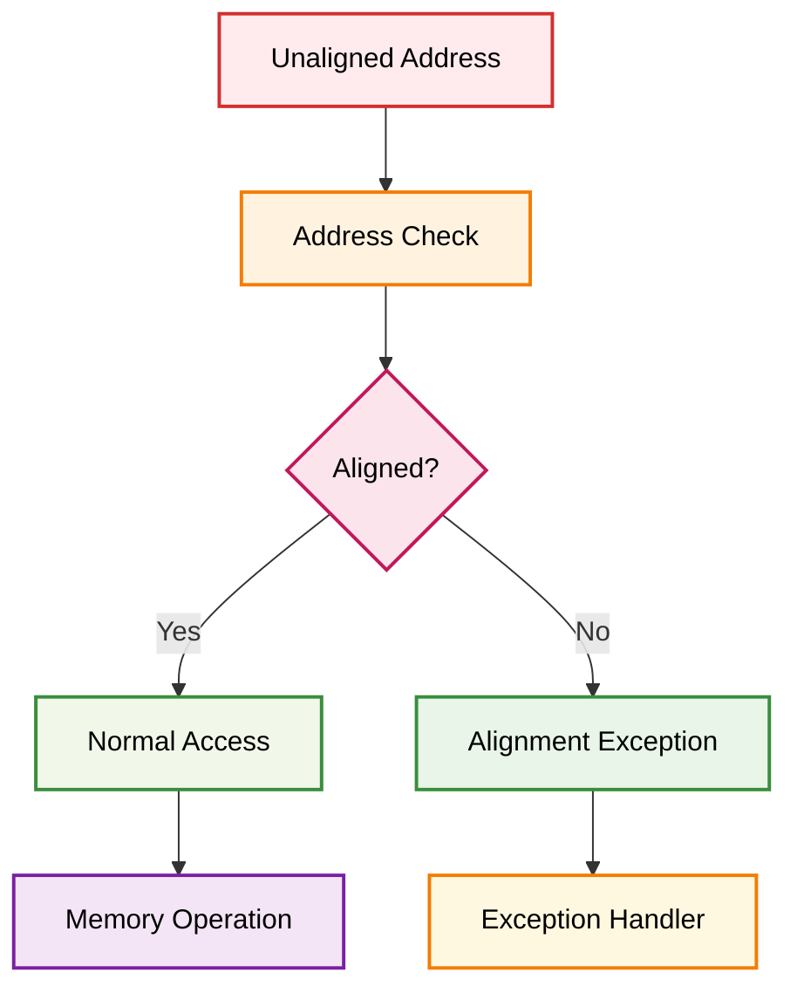

### 3. Memory Protection
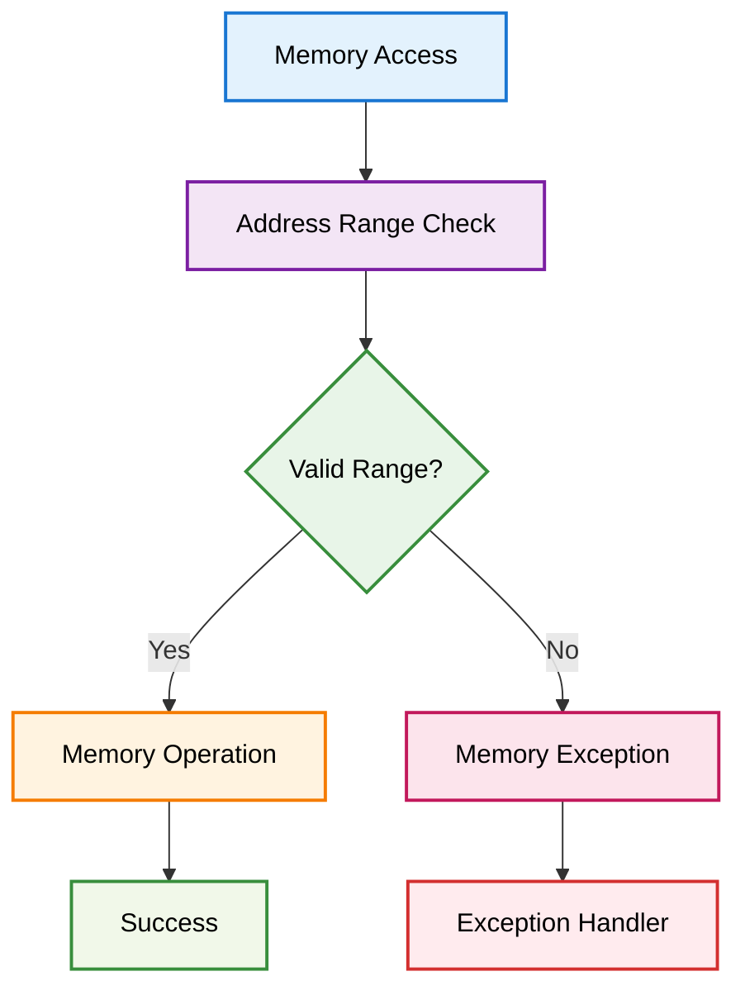

## Optimizaciones Implementadas

### 1. Memoria Optimizada
- Acceso directo sin latencia adicional
- Soporte para diferentes tamaños de datos
- Alineación automática

### 2. Control de Hazards
- Detección de load-use hazards
- Forwarding desde memoria
- Stall automático cuando es necesario

### 3. Debug Support
- Acceso a memoria para debug
- Monitoreo de operaciones
- Lectura de datos de memoria

## Integración con Debug Unit

La etapa MEM se integra con la debug unit para permitir:
- Lectura de memoria vía UART
- Monitoreo de operaciones de memoria
- Verificación de datos en memoria
- Control de acceso a memoria

## Archivos Relacionados

- `MEM.v`: Módulo principal de la etapa
- `MEMDATA.v`: Memoria de datos
- `EX_MEM.v`: Registro de segmentación de entrada
- `MEM_WB.v`: Registro de segmentación de salida
- `testbenchs/load_store.v`: Testbench de operaciones de memoria
- `testbenchs/store_test.v`: Testbench específico para store 