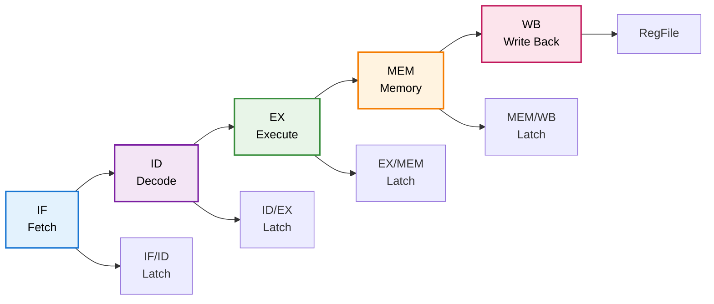
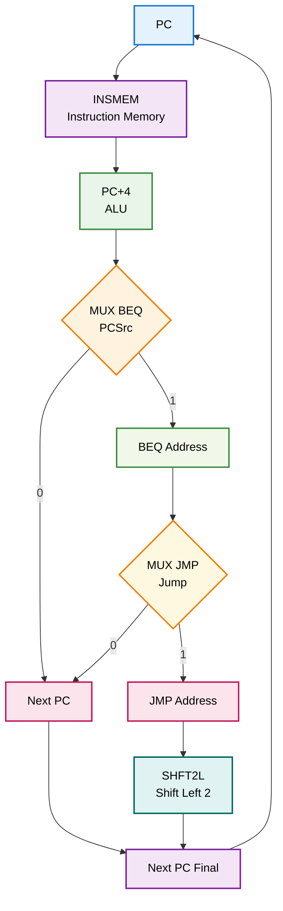
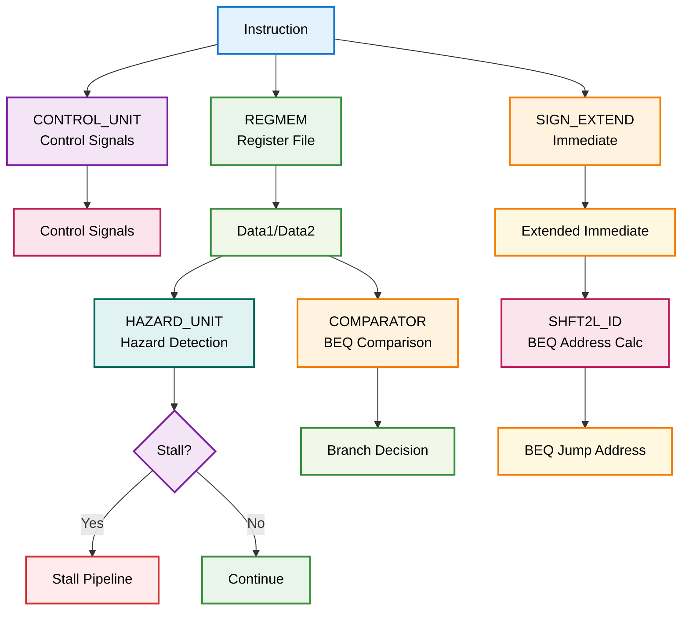
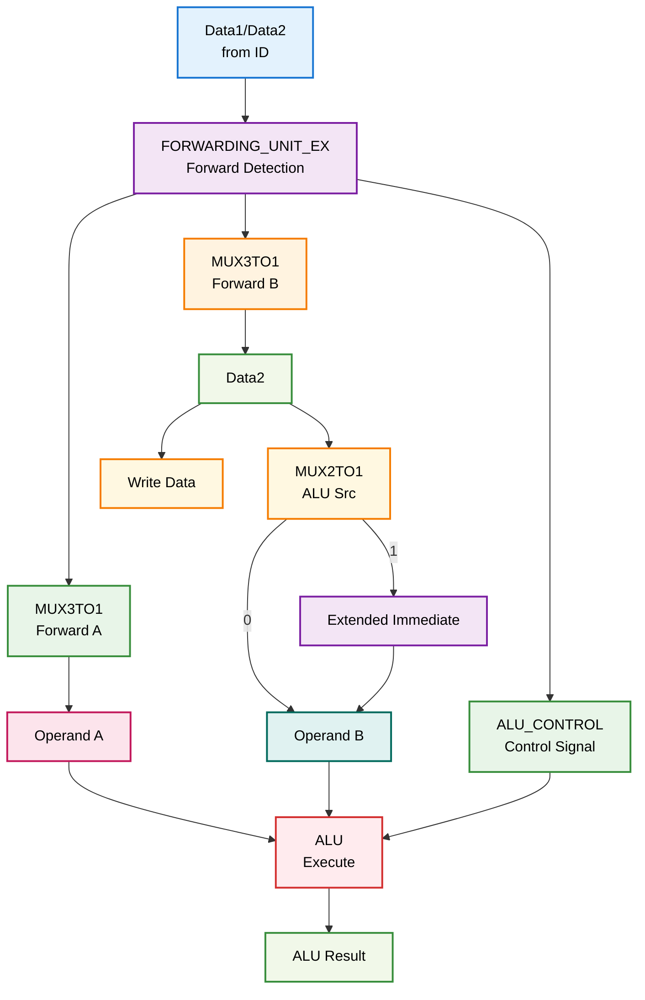
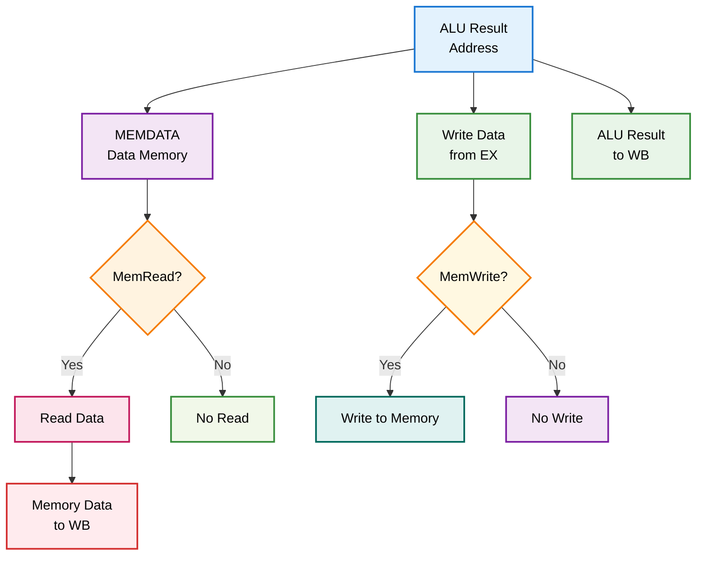
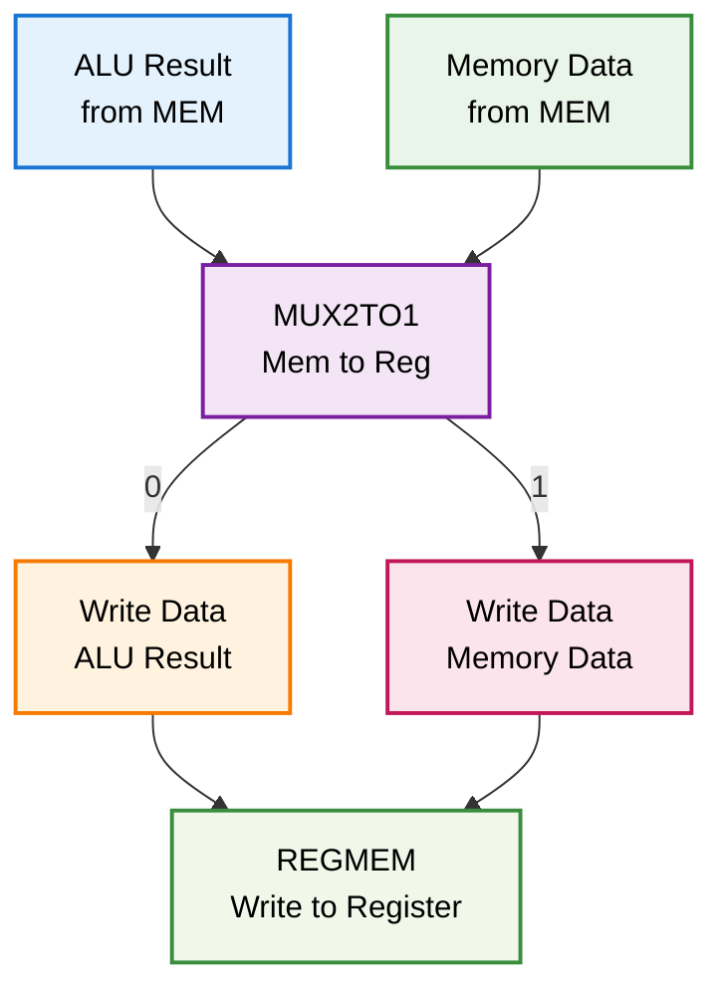
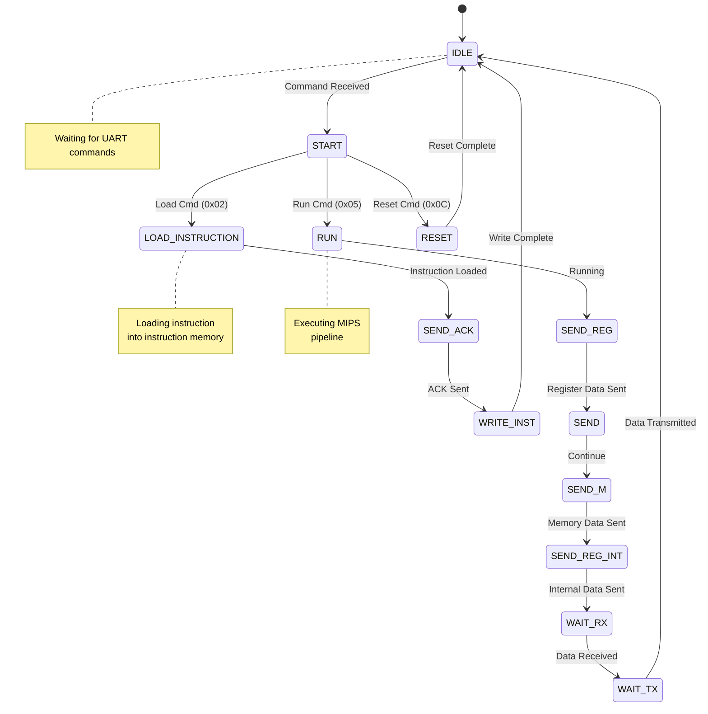
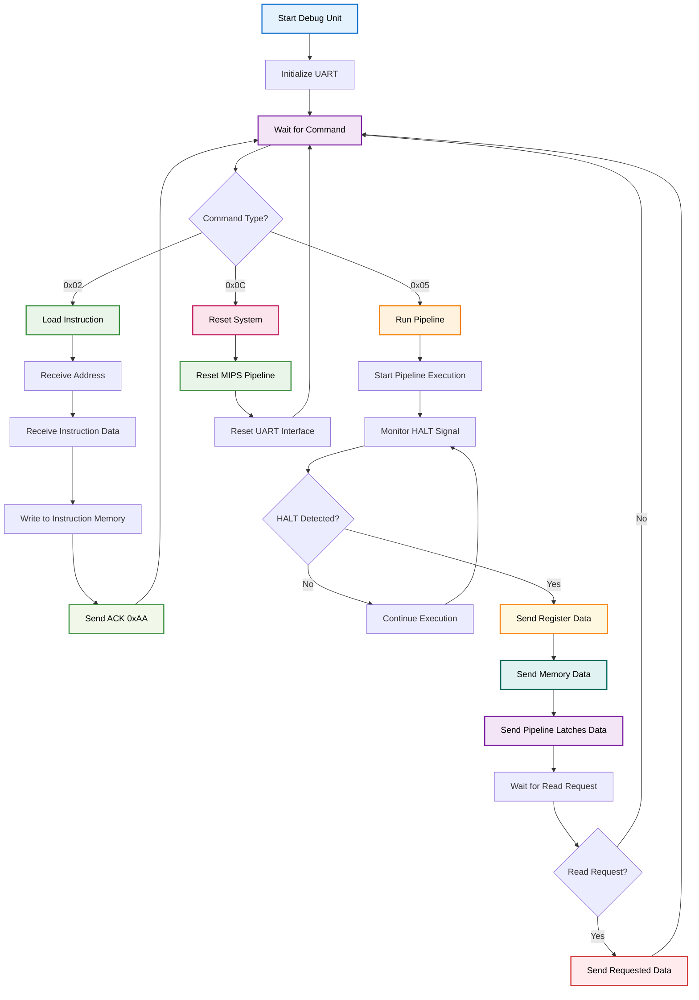
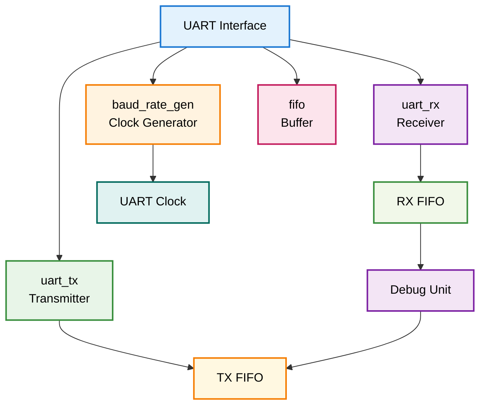

# MIPS Pipeline Processor

## Descripción General

Este proyecto implementa un procesador MIPS de 5 etapas con pipeline completo, incluyendo unidades de forwarding, hazard detection, y una unidad de debug integrada. El procesador está diseñado para ejecutar instrucciones MIPS básicas y está optimizado para implementación en FPGA.

## Arquitectura del Pipeline



## Estructura del Proyecto

```
MIPS_Pipeline/
├── TOP.v                    # Módulo principal del sistema
├── PIPELINE.v              # Módulo principal del pipeline
├── Basys3_Master.xdc       # Constraints para FPGA Basys3
├── IF/                     # Etapa de Fetch (Instruction Fetch)
├── ID/                     # Etapa de Decode
├── EX/                     # Etapa de Execute
├── Mem/                    # Etapa de Memory
├── WB/                     # Etapa de Write Back
├── SEGREGS/                # Registros de segmentación
├── debugunit/              # Unidad de debug con UART
├── utils/                  # Módulos utilitarios
├── testbenchs/             # Testbenches para verificación
└── py/                     # Interfaz de usuario en Python
```

## Módulos Principales

### 1. TOP.v - Módulo Principal del Sistema

**Descripción**: Módulo de nivel superior que integra el pipeline MIPS con la unidad de debug y el sistema de reloj.

**Funcionalidades**:
- Generación de reloj de 50MHz
- Integración con unidad de debug UART
- Control de LEDs de estado
- Interfaz con FPGA Basys3

**Interfaces**:
- `clock`: Reloj de entrada (100MHz)
- `i_reset`: Señal de reset
- `RsRx/RsTx`: Comunicación UART
- LEDs de estado: `rx_led`, `tx_led`, `idle_led`, `halt_led`, `running_led`

### 2. PIPELINE.v - Módulo Principal del Pipeline

**Descripción**: Implementa el pipeline completo de 5 etapas con todas las unidades de control y forwarding.

**Características**:
- Pipeline de 5 etapas: IF, ID, EX, MEM, WB
- Forwarding unit para evitar hazards de datos
- Hazard detection unit
- Control unit para todas las instrucciones MIPS
- Integración con debug unit

## Etapas del Pipeline

### Etapa IF (Instruction Fetch)

**Módulos**:
- `IF.v`: Controlador principal de la etapa
- `PC.v`: Contador de programa
- `INSMEM.v`: Memoria de instrucciones
- `SHFT2L.v`: Desplazamiento para instrucciones de salto

**Funcionalidades**:
- Lectura de instrucciones desde memoria
- Cálculo de PC+4
- Manejo de saltos (BEQ, JMP)
- Control de stall y flush

**Diagrama de Flujo**:


### Etapa ID (Instruction Decode)

**Módulos**:
- `ID.v`: Controlador principal de la etapa
- `REGMEM.v`: Banco de registros
- `CONTROL_UNIT.v`: Unidad de control
- `HAZARD_UNIT.v`: Detección de hazards
- `FORWARDING_UNIT_ID.v`: Forwarding para etapa ID
- `SIGN_EXTEND.v`: Extensión de signo
- `SHFT2L_ID.v`: Desplazamiento para BEQ
- `COMPARATOR.V`: Comparador para BEQ
- `AND_ID.v`: Compuerta AND para control

**Funcionalidades**:
- Decodificación de instrucciones
- Lectura de registros
- Generación de señales de control
- Detección de hazards de datos
- Cálculo de dirección de salto para BEQ

**Diagrama de Flujo**:


### Etapa EX (Execute)

**Módulos**:
- `EX.v`: Controlador principal de la etapa
- `ALU.v`: Unidad Aritmético-Lógica
- `ALU_CONTROL.v`: Control de la ALU
- `FORWARDING_UNIT_EX.v`: Forwarding para etapa EX
- `MUX2TO1_EX.v`: Multiplexor 2:1
- `MUX3TO1.v`: Multiplexor 3:1

**Funcionalidades**:
- Ejecución de operaciones aritméticas y lógicas
- Forwarding de datos para evitar hazards
- Selección de operandos
- Cálculo de direcciones de memoria

**Diagrama de Flujo**:


### Etapa MEM (Memory)

**Módulos**:
- `MEM.v`: Controlador principal de la etapa
- `MEMDATA.v`: Memoria de datos

**Funcionalidades**:
- Acceso a memoria de datos
- Operaciones de load/store
- Control de señales de memoria

**Diagrama de Flujo**:


### Etapa WB (Write Back)

**Módulos**:
- `WB.v`: Controlador principal de la etapa

**Funcionalidades**:
- Escritura de resultados en banco de registros
- Selección entre resultado de ALU y datos de memoria

**Diagrama de Flujo**:


## Registros de Segmentación

### IF/ID.v
**Descripción**: Registro de segmentación entre etapas IF e ID
**Datos almacenados**:
- PC+4
- Instrucción leída

### ID/EX.v
**Descripción**: Registro de segmentación entre etapas ID y EX
**Datos almacenados**:
- Datos de registros
- Señales de control
- Inmediatos extendidos
- Direcciones de registros

### EX/MEM.v
**Descripción**: Registro de segmentación entre etapas EX y MEM
**Datos almacenados**:
- Resultado de ALU
- Datos a escribir en memoria
- Señales de control de memoria
- Dirección de registro destino

### MEM/WB.v
**Descripción**: Registro de segmentación entre etapas MEM y WB
**Datos almacenados**:
- Datos leídos de memoria
- Resultado de ALU
- Señales de control de escritura
- Dirección de registro destino

## Unidad de Debug

### debug_unit.v
**Descripción**: Unidad de debug completa con interfaz UART
**Funcionalidades**:
- Carga de instrucciones vía UART
- Lectura de estado de registros
- Lectura de estado de memoria
- Control de ejecución (run/stop/reset)
- Monitoreo de pipeline

**Diagrama de Estados de la FSM**:


**Diagrama de Flujo Detallado de la Debug Unit**:


### Módulos UART
- `UART.v`: Módulo principal de UART
- `uart_rx.v`: Receptor UART
- `uart_tx.v`: Transmisor UART
- `baud_rate_gen.v`: Generador de baud rate
- `fifo.v`: Buffer FIFO para datos

**Arquitectura UART**:


## Módulos Utilitarios

### ALU.v
**Descripción**: Unidad Aritmético-Lógica
**Operaciones soportadas**:
- Suma, resta, multiplicación
- AND, OR, XOR, NOR
- Desplazamientos lógicos y aritméticos
- Comparaciones (signed/unsigned)

### MUX2TO1.v
**Descripción**: Multiplexor 2:1 genérico
**Aplicaciones**:
- Selección de operandos
- Selección de direcciones
- Control de flujo

## Instrucciones Soportadas

### Instrucciones Aritméticas
- `ADD`, `ADDI`, `ADDIU`, `ADDU`: Suma
- `SUB`, `SUBU`: Resta
- `MULT`, `MULTU`: Multiplicación

### Instrucciones Lógicas
- `AND`, `ANDI`: AND lógico
- `OR`, `ORI`: OR lógico
- `XOR`, `XORI`: XOR lógico
- `NOR`: NOR lógico

### Instrucciones de Desplazamiento
- `SLL`, `SRL`, `SRA`: Desplazamientos
- `SLLV`, `SRLV`, `SRAV`: Desplazamientos variables

### Instrucciones de Comparación
- `SLT`, `SLTI`: Comparación signed
- `SLTU`, `SLTIU`: Comparación unsigned

### Instrucciones de Salto
- `BEQ`: Salto si igual
- `BNE`: Salto si no igual
- `J`: Salto incondicional
- `JAL`: Salto y enlace

### Instrucciones de Memoria
- `LW`: Load word
- `SW`: Store word
- `LB`, `SB`: Load/Store byte
- `LH`, `SH`: Load/Store halfword

## Características del Pipeline

### Forwarding (Data Hazard Resolution)
- Forwarding desde EX/MEM a EX
- Forwarding desde MEM/WB a EX
- Forwarding desde EX/MEM a ID (para BEQ)

### Hazard Detection
- Detección de hazards de datos
- Stall automático cuando es necesario
- Flush de pipeline para saltos

### Control Unit
- Generación automática de señales de control
- Soporte para todas las instrucciones MIPS básicas
- Control de memoria y registros

## Interfaz de Usuario

### user_interface.py
**Descripción**: Interfaz gráfica en Python para control del procesador
**Funcionalidades**:
- Carga de programas
- Monitoreo de registros
- Visualización de pipeline
- Control de ejecución

## Testbenches

El proyecto incluye testbenches completos para:
- Instrucciones individuales
- Secuencias de instrucciones
- Casos de forwarding
- Casos de hazard detection
- Unidad de debug

## Implementación en FPGA

### Basys3_Master.xdc
**Descripción**: Archivo de constraints para FPGA Basys3
**Configuración**:
- Reloj de 100MHz
- UART a 19200 baudios
- LEDs de estado
- Switches de control

## Uso del Sistema

### 1. Carga de Programa
```bash
# Compilar el proyecto
# Cargar en FPGA
# Usar interfaz Python para cargar instrucciones
```

### 2. Ejecución
```bash
# Enviar comando RUN vía UART
# Monitorear LEDs de estado
# Observar ejecución en tiempo real
```

### 3. Debug
```bash
# Usar comandos UART para:
# - Leer registros
# - Leer memoria
# - Pausar ejecución
# - Resetear sistema
```

## Comandos UART

| Comando | Función |
|---------|---------|
| 0x02 | Cargar instrucción |
| 0x05 | Ejecutar programa |
| 0x0C | Resetear sistema |
| 0xAA | Acknowledgment |

## Especificaciones Técnicas

- **Arquitectura**: MIPS 32-bit
- **Pipeline**: 5 etapas
- **Memoria**: Harvard (separada instrucciones/datos)
- **Registros**: 32 registros de propósito general
- **Reloj**: 50MHz (interno)
- **UART**: 19200 baudios
- **FPGA**: Basys3 (Artix-7)

## Estado del Proyecto

✅ **Completado**:
- Pipeline de 5 etapas
- Forwarding unit
- Hazard detection
- Debug unit con UART
- Testbenches completos
- Implementación en FPGA

🔄 **En Desarrollo**:
- Optimizaciones de rendimiento
- Instrucciones adicionales
- Interfaz gráfica mejorada

## Contribuciones

Este proyecto es desarrollado como parte de un curso de arquitectura de computadores. Las contribuciones son bienvenidas a través de pull requests.

## Licencia

Este proyecto está bajo licencia MIT. Ver archivo LICENSE para más detalles.