# Etapa WB (Write Back)

## Descripción General

La etapa WB (Write Back) es la quinta y última etapa del pipeline MIPS. Su función principal es escribir los resultados de las operaciones en el banco de registros, completando así el ciclo de ejecución de una instrucción.

## Arquitectura del Módulo

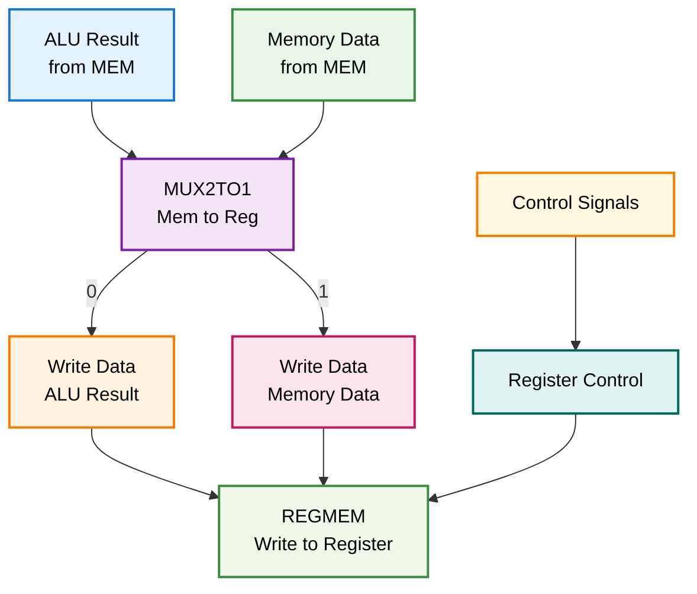

## Módulos Componentes

### 1. WB.v - Controlador de Write Back

**Descripción**: Módulo principal que controla la escritura de resultados en el banco de registros.

**Funcionalidades**:
- Selección entre resultado de ALU y datos de memoria
- Control de escritura en registros
- Integración con debug unit
- Completación del ciclo de instrucción

**Interfaces**:
```verilog
module WB(
    input wire [31:0] alu_result,
    input wire [31:0] memory_data,
    input wire mem_to_reg,
    input wire reg_write,
    input wire [4:0] rd,
    output wire [31:0] write_data,
    output wire [4:0] write_reg,
    output wire write_enable
);
```

**Diagrama de Control**:
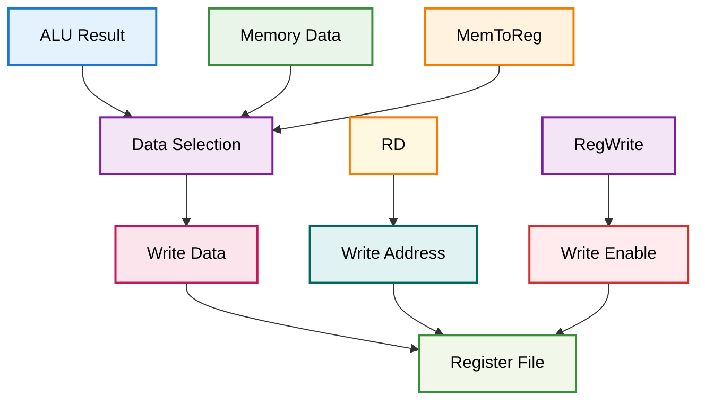

## Tipos de Operaciones

### Operaciones R-Type (ALU)
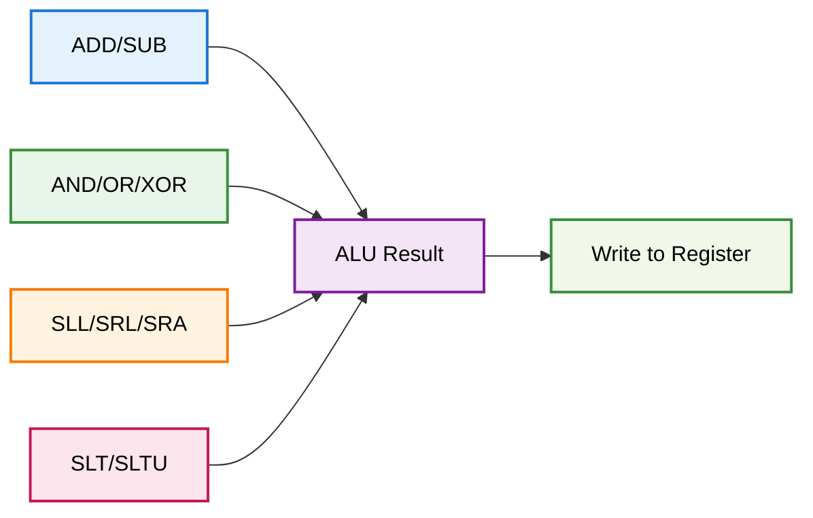

### Operaciones I-Type (Load)
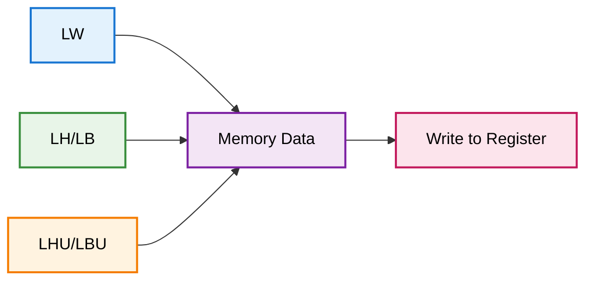

### Operaciones I-Type (Immediate)
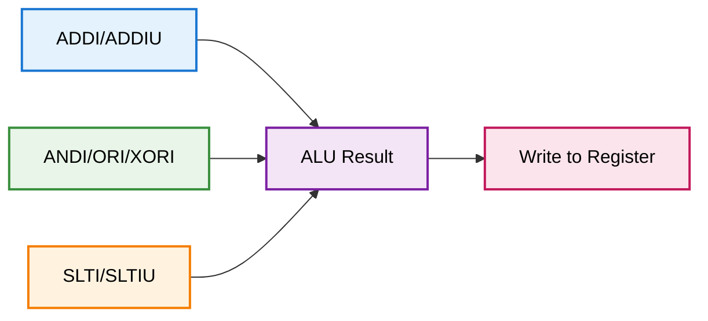

## Flujo de Datos Detallado

### Write Back de Operación ALU
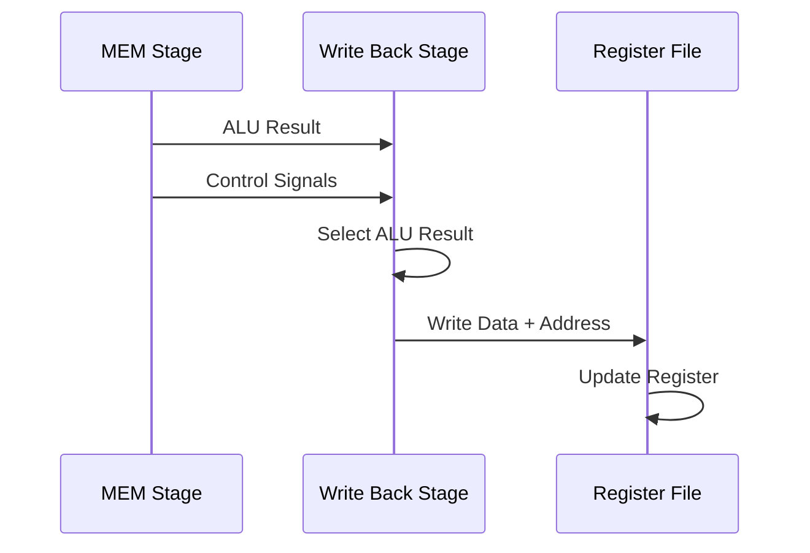

### Write Back de Operación Load
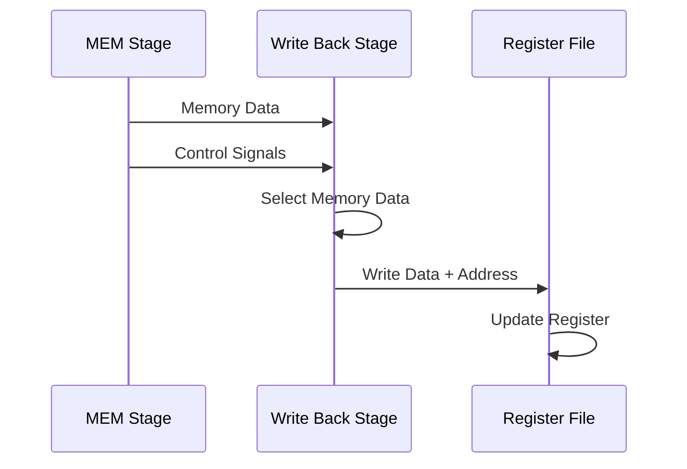

### Write Back de Operación Store
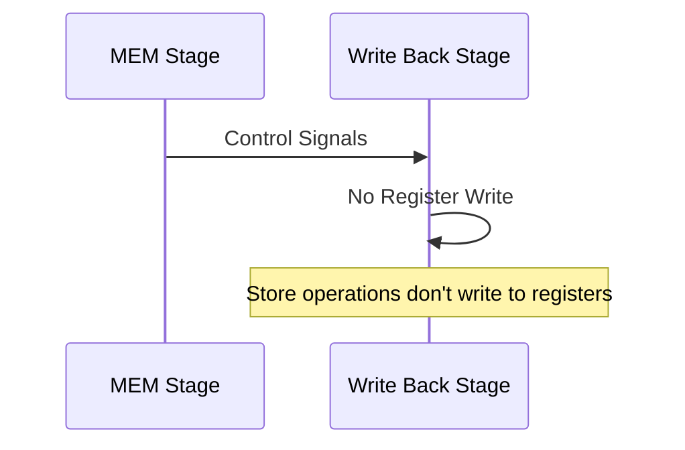

## Selección de Datos

### Multiplexor MemToReg
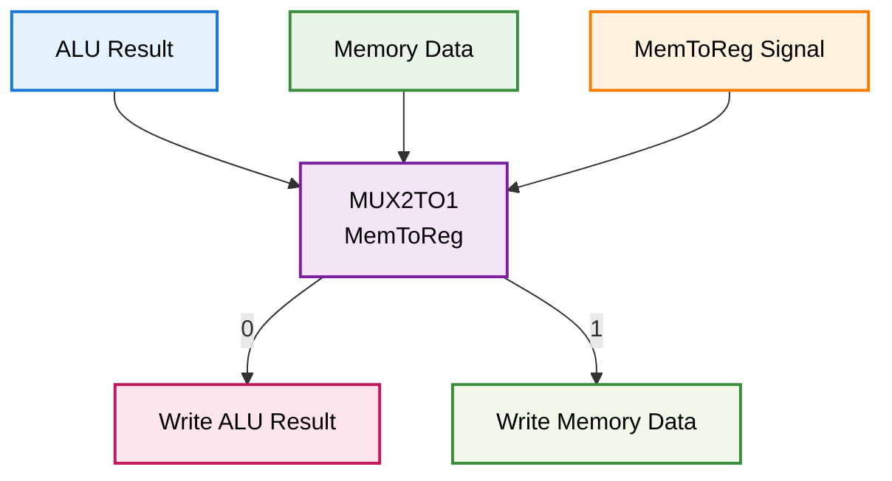

### Control de Escritura
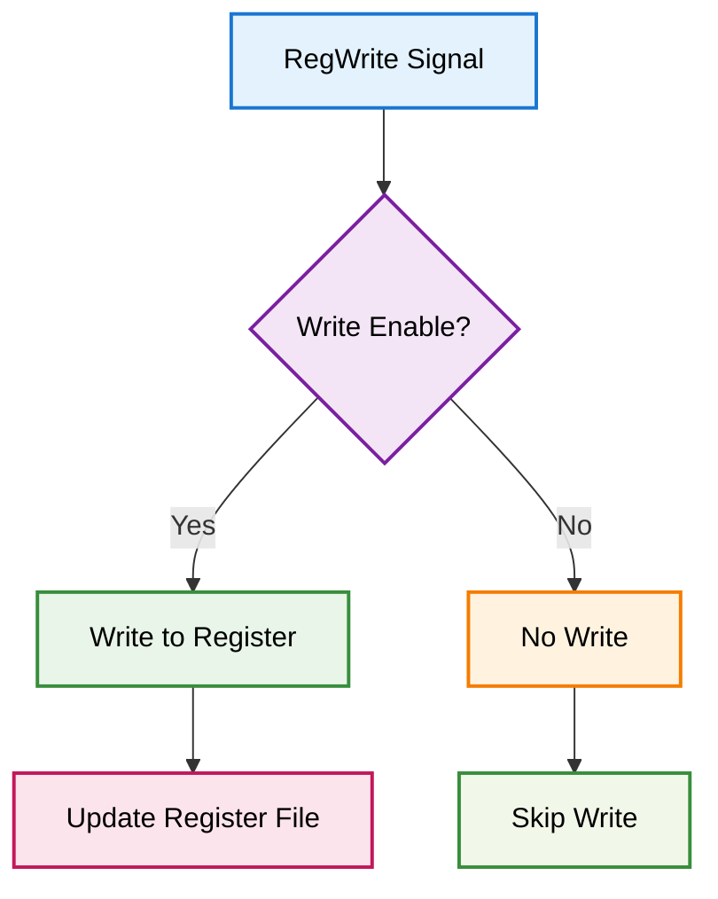

## Señales de Control

### Señales de Entrada
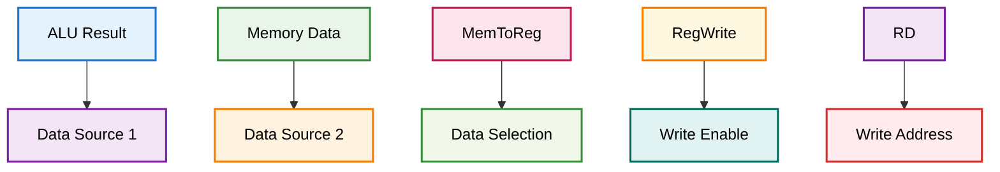

### Señales de Salida
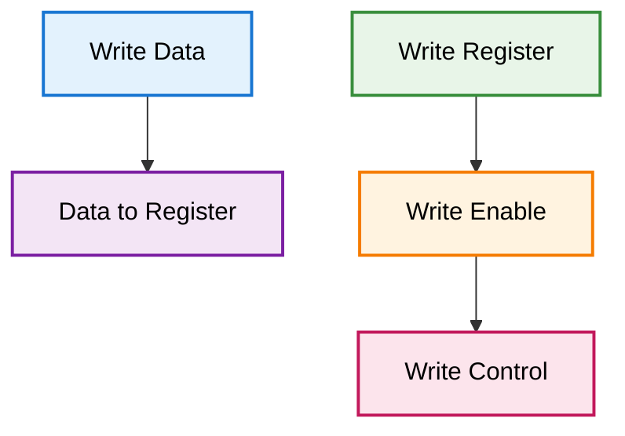

## Timing y Latencia

### Timing Diagram
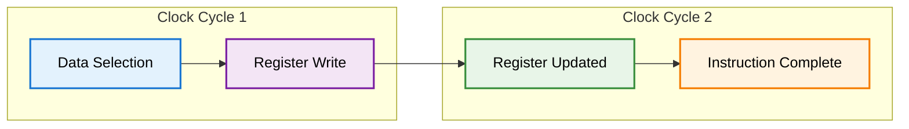

### Latencia de Write Back
- **Selección de datos**: Combinacional
- **Escritura en registro**: 1 ciclo de reloj
- **Total**: 1 ciclo de reloj

## Casos Especiales

### 1. Write to R0
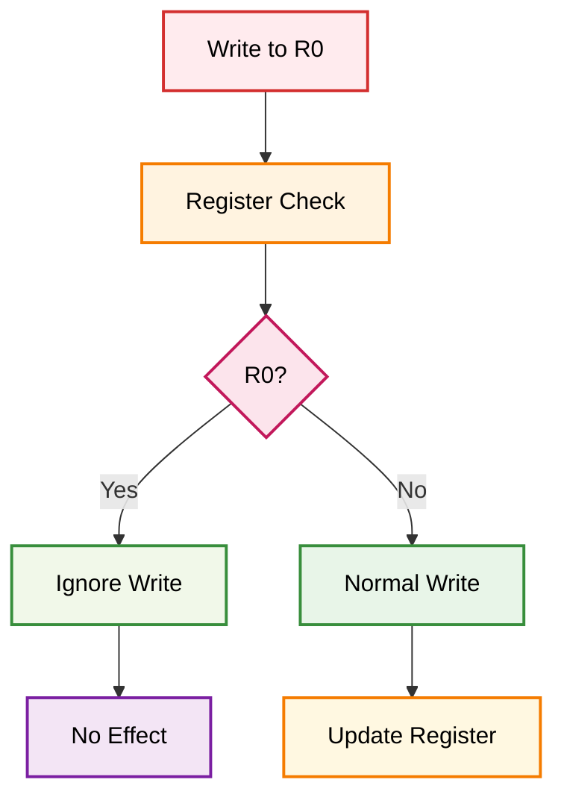

### 2. Multiple Writes
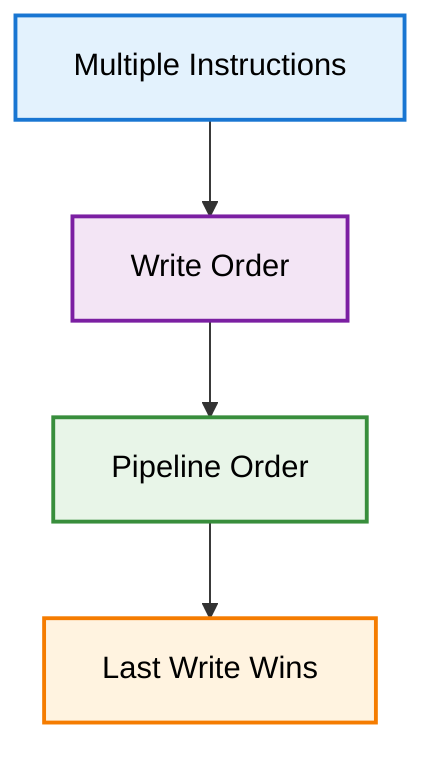

### 3. Forwarding Completion
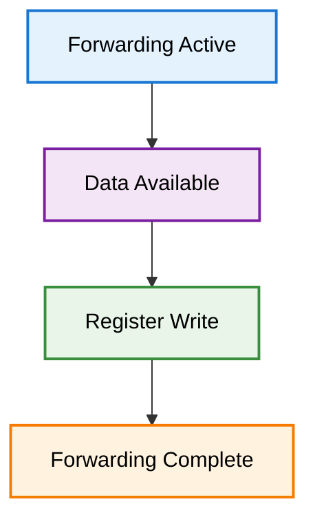

## Completación de Instrucciones

### Ciclo de Vida de una Instrucción
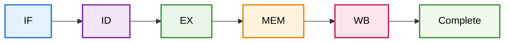

### Estados de Completación
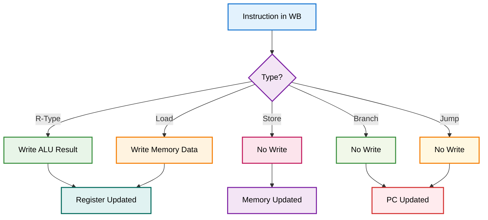

## Optimizaciones Implementadas

### 1. Write Back Optimizado
- Selección de datos eficiente
- Control de escritura optimizado
- Integración con forwarding

### 2. Control de Hazards
- Completación de forwarding
- Resolución de dependencias
- Actualización de registros

### 3. Debug Support
- Monitoreo de escrituras
- Verificación de resultados
- Control de completación

## Integración con Debug Unit

La etapa WB se integra con la debug unit para permitir:
- Monitoreo de escrituras en registros
- Verificación de resultados finales
- Control de completación de instrucciones
- Debug de forwarding

## Archivos Relacionados

- `WB.v`: Módulo principal de la etapa
- `MEM_WB.v`: Registro de segmentación de entrada
- `REGMEM.v`: Banco de registros (en etapa ID)
- `testbenchs/`: Testbenches relacionados 