# Unidad de Debug

## Descripción General

La unidad de debug es un componente esencial del procesador MIPS que permite el control, monitoreo y depuración del pipeline a través de una interfaz UART. Proporciona capacidades de carga de instrucciones, control de ejecución, y lectura de estado interno del procesador.

## Arquitectura del Módulo

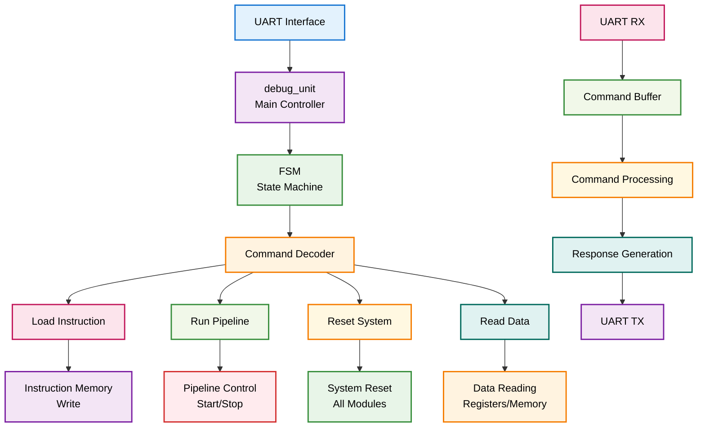

## Módulos Componentes

### 1. debug_unit.v - Controlador Principal

**Descripción**: Módulo principal que coordina todas las operaciones de debug.

**Funcionalidades**:
- Máquina de estados finitos (FSM)
- Decodificación de comandos UART
- Control de carga de instrucciones
- Monitoreo de estado del pipeline
- Generación de respuestas

**Interfaces**:
```verilog
module debug_unit(
    input wire clk,
    input wire reset,
    input wire [7:0] rx_data,
    input wire rx_done,
    input wire tx_busy,
    input wire [31:0] reg_data,
    input wire [31:0] mem_data,
    input wire [31:0] latch_data,
    input wire halt_signal,
    output reg [7:0] tx_data,
    output reg tx_start,
    output reg [31:0] inst_addr,
    output reg [31:0] inst_data,
    output reg inst_write,
    output reg [4:0] reg_addr,
    output reg [31:0] mem_addr,
    output reg run_signal,
    output reg reset_signal
);
```

**Diagrama de Estados FSM**:
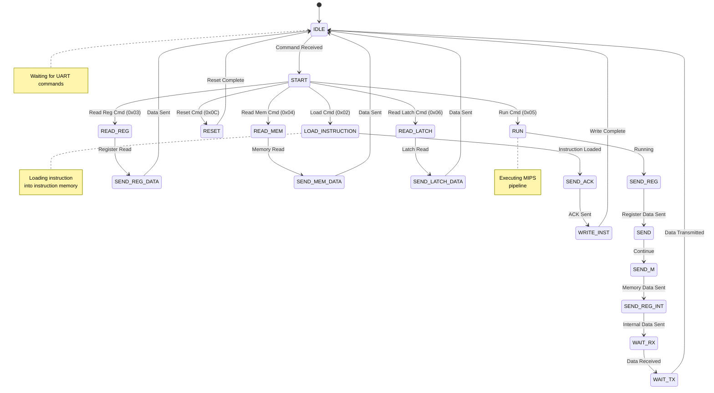

### 2. UART.v - Interfaz de Comunicación

**Descripción**: Módulo principal de UART que maneja la comunicación serial.

**Características**:
- Configuración de baud rate
- Recepción y transmisión de datos
- Buffers FIFO para datos
- Control de flujo

**Interfaces**:
```verilog
module UART(
    input wire clk,
    input wire reset,
    input wire rx,
    input wire [7:0] tx_data,
    input wire tx_start,
    output wire tx,
    output wire [7:0] rx_data,
    output wire rx_done,
    output wire tx_busy
);
```

**Diagrama de Arquitectura UART**:
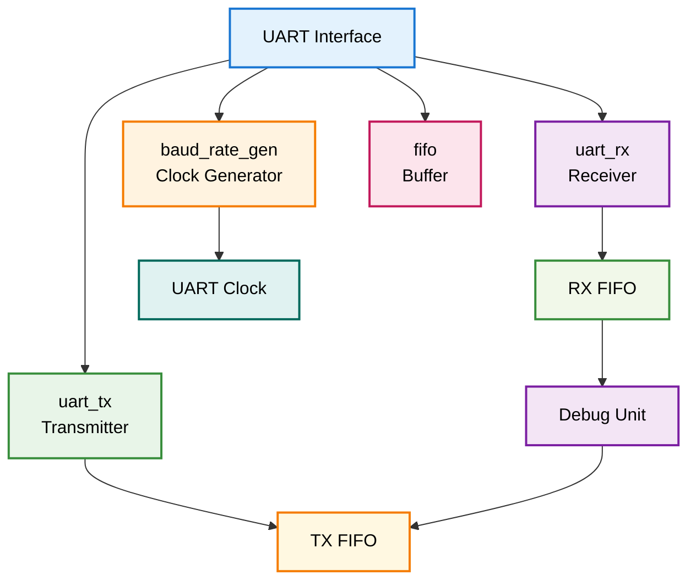

### 3. uart_rx.v - Receptor UART

**Descripción**: Módulo que recibe datos seriales y los convierte a paralelo.

**Funcionalidades**:
- Detección de start/stop bits
- Muestreo de datos
- Validación de paridad
- Generación de señales de control

**Interfaces**:
```verilog
module uart_rx(
    input wire clk,
    input wire reset,
    input wire rx,
    input wire baud_clk,
    output reg [7:0] data,
    output reg done
);
```

### 4. uart_tx.v - Transmisor UART

**Descripción**: Módulo que convierte datos paralelos a seriales para transmisión.

**Funcionalidades**:
- Generación de start/stop bits
- Transmisión de datos
- Control de timing
- Señales de estado

**Interfaces**:
```verilog
module uart_tx(
    input wire clk,
    input wire reset,
    input wire [7:0] data,
    input wire start,
    input wire baud_clk,
    output reg tx,
    output reg busy
);
```

### 5. baud_rate_gen.v - Generador de Baud Rate

**Descripción**: Genera el reloj necesario para la comunicación UART.

**Funcionalidad**:
- División de frecuencia
- Configuración de baud rate
- Sincronización de reloj

**Interfaces**:
```verilog
module baud_rate_gen(
    input wire clk,
    input wire reset,
    output reg baud_clk
);
```

### 6. fifo.v - Buffer FIFO

**Descripción**: Buffer de datos para almacenamiento temporal.

**Características**:
- Almacenamiento FIFO
- Control de overflow/underflow
- Indicadores de estado

**Interfaces**:
```verilog
module fifo(
    input wire clk,
    input wire reset,
    input wire [7:0] data_in,
    input wire write_en,
    input wire read_en,
    output wire [7:0] data_out,
    output wire full,
    output wire empty
);
```

## Comandos UART Soportados

### Tabla de Comandos
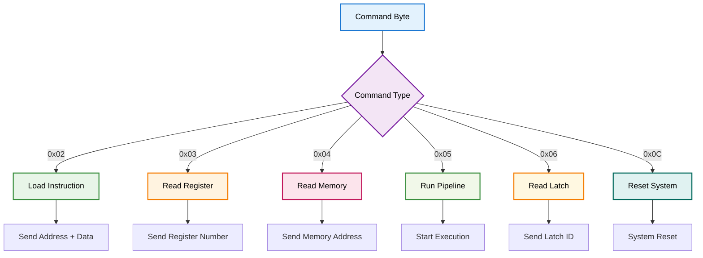

### Protocolo de Comunicación
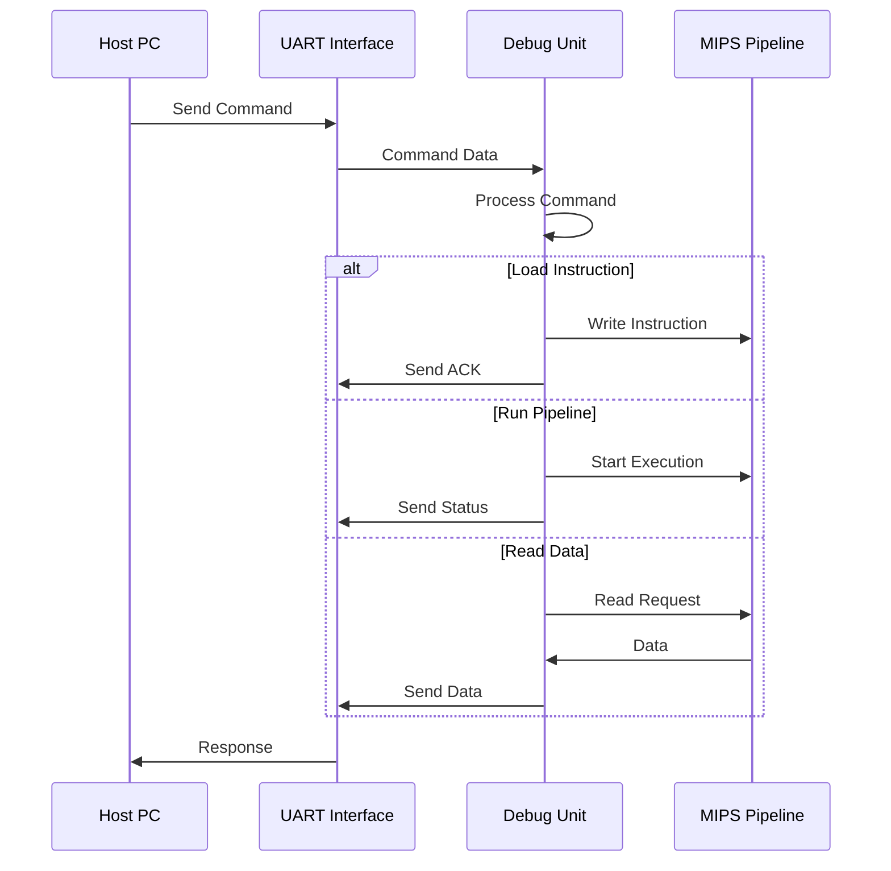

## Flujo de Datos Detallado

### Carga de Instrucciones
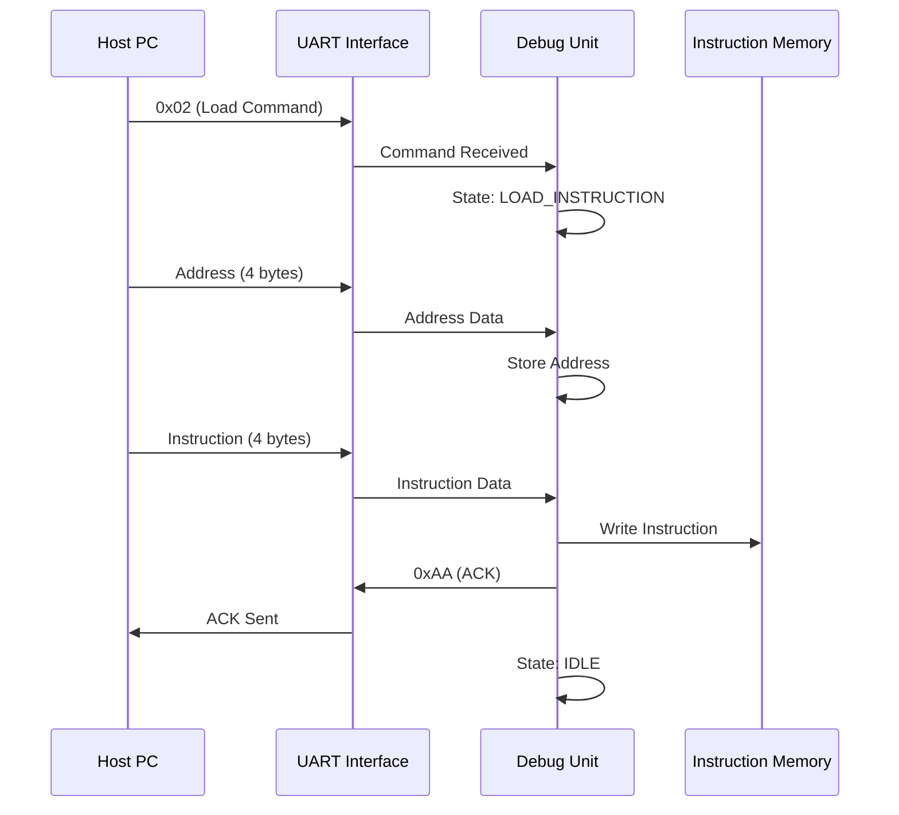

### Ejecución del Pipeline
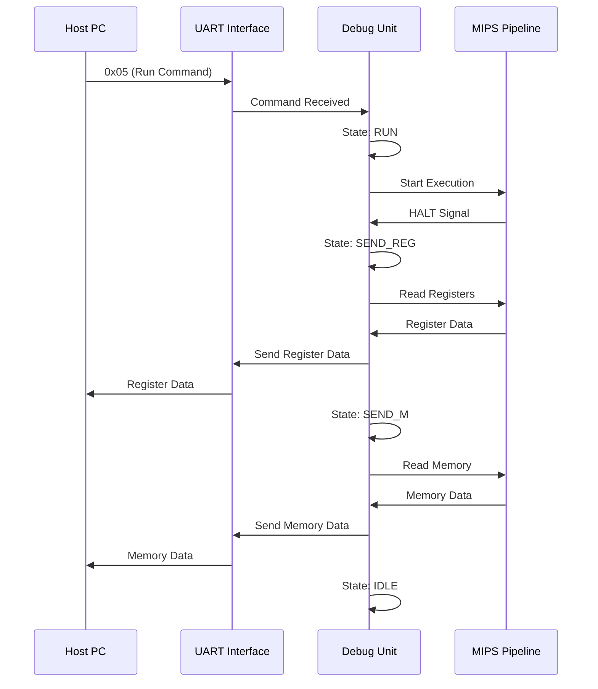

### Lectura de Datos
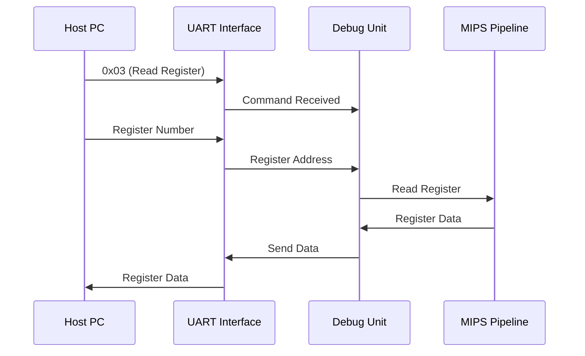

## Estados de la FSM

### Diagrama de Estados Detallado
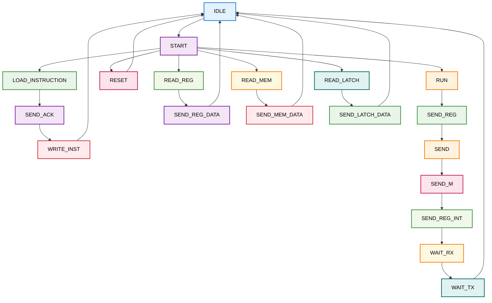

## Integración con el Pipeline

### Conexiones con Etapas del Pipeline
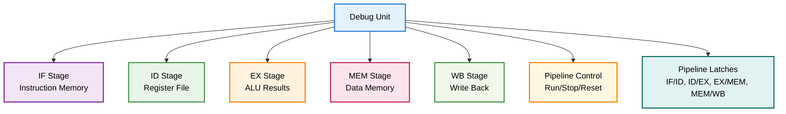

### Señales de Control
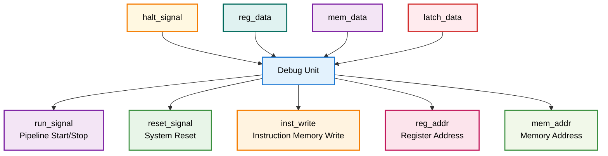

## Configuración UART

### Parámetros de Comunicación
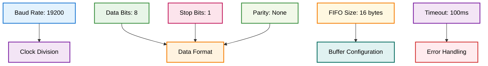

## Casos de Uso

### Debug de Programa
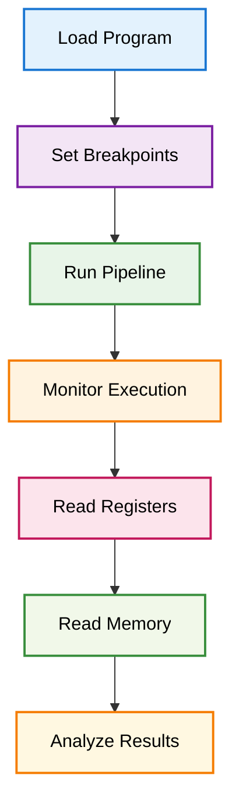

### Verificación de Hazards
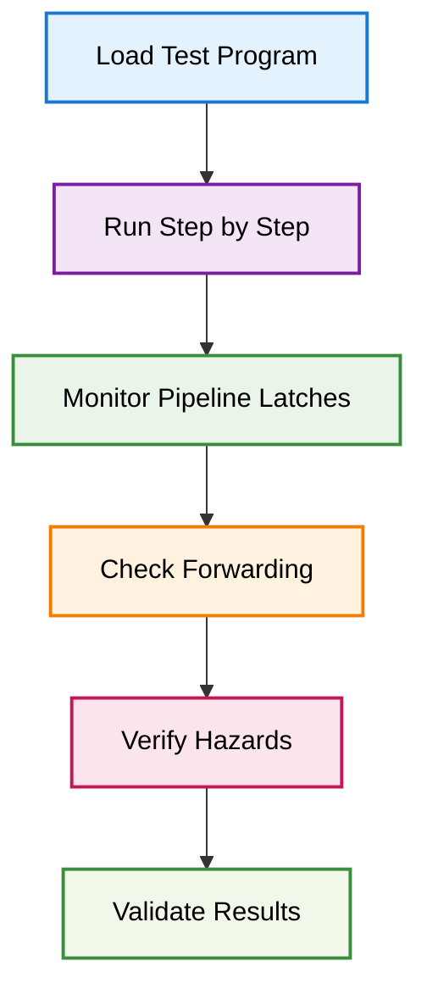

## Archivos Relacionados

- `debug_unit.v`: Módulo principal de debug
- `UART.v`: Interfaz UART principal
- `uart_rx.v`: Receptor UART
- `uart_tx.v`: Transmisor UART
- `baud_rate_gen.v`: Generador de baud rate
- `fifo.v`: Buffer FIFO
- `testbenchs/uart_test.v`: Testbench de UART 