# Módulos Utilitarios

## Descripción General

Los módulos utilitarios son componentes reutilizables que proporcionan funcionalidades básicas utilizadas en múltiples etapas del pipeline MIPS. Estos módulos incluyen la Unidad Aritmético-Lógica (ALU) y multiplexores genéricos.

## Arquitectura General

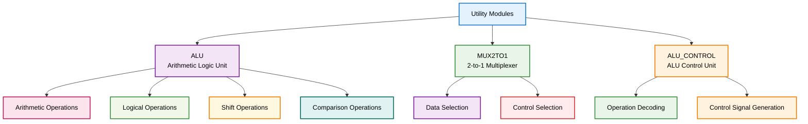

## Módulos Componentes

### 1. ALU.v - Unidad Aritmético-Lógica

**Descripción**: Módulo central que ejecuta todas las operaciones aritméticas y lógicas del procesador MIPS.

**Funcionalidades**:
- Operaciones aritméticas (ADD, SUB, MULT)
- Operaciones lógicas (AND, OR, XOR, NOR)
- Operaciones de desplazamiento (SLL, SRL, SRA)
- Operaciones de comparación (SLT, SLTU)
- Generación de flags de condición

**Interfaces**:
```verilog
module ALU(
    input wire [31:0] data_a,
    input wire [31:0] data_b,
    input wire [5:0] operation,
    output reg [31:0] result,
    output reg zero_flag
);
```

**Diagrama de Arquitectura ALU**:
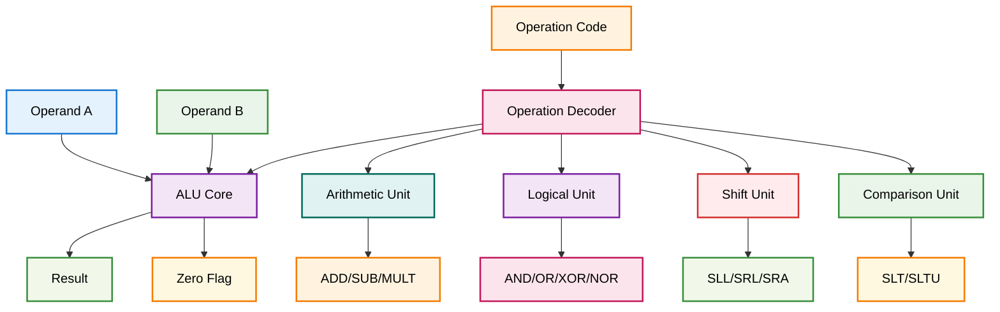

#### Operaciones Aritméticas
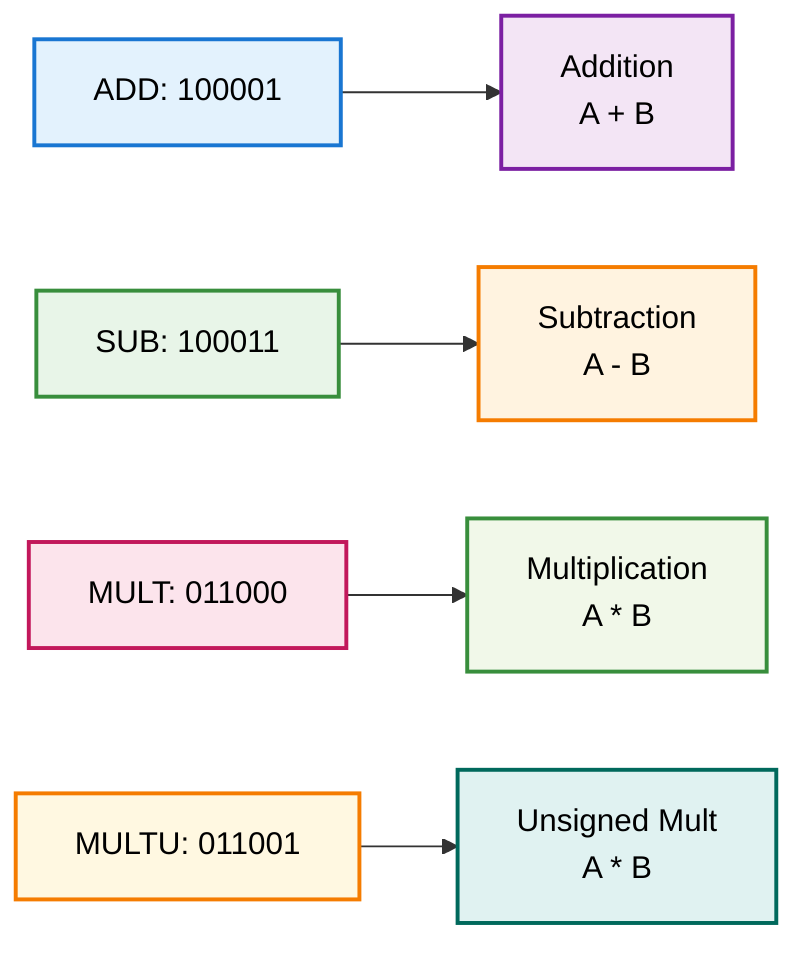

#### Operaciones Lógicas
```mermaid
graph LR
    A[AND: 100100] --> B[Logical AND<br/>A & B]
    C[OR: 100101] --> D[Logical OR<br/>A | B]
    E[XOR: 100110] --> F[Logical XOR<br/>A ^ B]
    G[NOR: 100111] --> H[Logical NOR<br/>~(A | B)]
    
    style A fill:#e3f2fd,stroke:#1976d2,stroke-width:2px,color:#000
    style B fill:#f3e5f5,stroke:#7b1fa2,stroke-width:2px,color:#000
    style C fill:#e8f5e8,stroke:#388e3c,stroke-width:2px,color:#000
    style D fill:#fff3e0,stroke:#f57c00,stroke-width:2px,color:#000
    style E fill:#fce4ec,stroke:#c2185b,stroke-width:2px,color:#000
    style F fill:#f1f8e9,stroke:#388e3c,stroke-width:2px,color:#000
    style G fill:#fff8e1,stroke:#f57c00,stroke-width:2px,color:#000
    style H fill:#e0f2f1,stroke:#00695c,stroke-width:2px,color:#000
```

#### Operaciones de Desplazamiento
```mermaid
graph LR
    A[SLL: 000000] --> B[Shift Left Logical<br/>B << A]
    C[SRL: 000010] --> D[Shift Right Logical<br/>B >> A]
    E[SRA: 000011] --> F[Shift Right Arithmetic<br/>B >>> A]
    G[SLLV: 000100] --> H[Shift Left Variable<br/>B << A[4:0]]
    I[SRLV: 000110] --> J[Shift Right Variable<br/>B >> A[4:0]]
    K[SRAV: 000111] --> L[Shift Right Arithmetic Variable<br/>B >>> A[4:0]]
    
    style A fill:#e3f2fd,stroke:#1976d2,stroke-width:2px,color:#000
    style B fill:#f3e5f5,stroke:#7b1fa2,stroke-width:2px,color:#000
    style C fill:#e8f5e8,stroke:#388e3c,stroke-width:2px,color:#000
    style D fill:#fff3e0,stroke:#f57c00,stroke-width:2px,color:#000
    style E fill:#fce4ec,stroke:#c2185b,stroke-width:2px,color:#000
    style F fill:#f1f8e9,stroke:#388e3c,stroke-width:2px,color:#000
    style G fill:#fff8e1,stroke:#f57c00,stroke-width:2px,color:#000
    style H fill:#e0f2f1,stroke:#00695c,stroke-width:2px,color:#000
    style I fill:#f3e5f5,stroke:#7b1fa2,stroke-width:2px,color:#000
    style J fill:#ffebee,stroke:#d32f2f,stroke-width:2px,color:#000
    style K fill:#e8f5e8,stroke:#388e3c,stroke-width:2px,color:#000
    style L fill:#fff3e0,stroke:#f57c00,stroke-width:2px,color:#000
```

#### Operaciones de Comparación
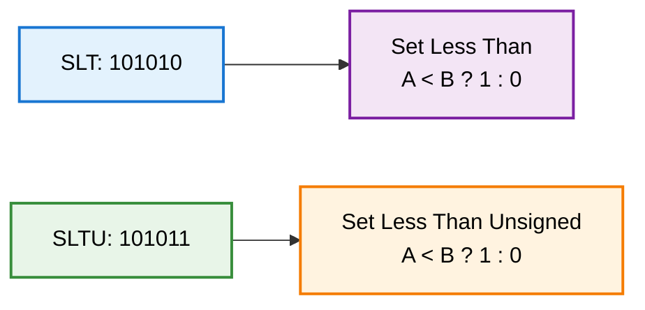

### 2. MUX2TO1.v - Multiplexor 2:1

**Descripción**: Multiplexor genérico de 2 entradas y 1 salida con ancho de datos configurable.

**Funcionalidades**:
- Selección entre dos entradas
- Ancho de datos configurable
- Control de selección de 1 bit
- Aplicaciones múltiples en el pipeline

**Interfaces**:
```verilog
module MUX2TO1 #(
    parameter WIDTH = 32
)(
    input wire [WIDTH-1:0] input_1,
    input wire [WIDTH-1:0] input_2,
    input wire selection_bit,
    output reg [WIDTH-1:0] mux
);
```

**Diagrama de Funcionamiento**:
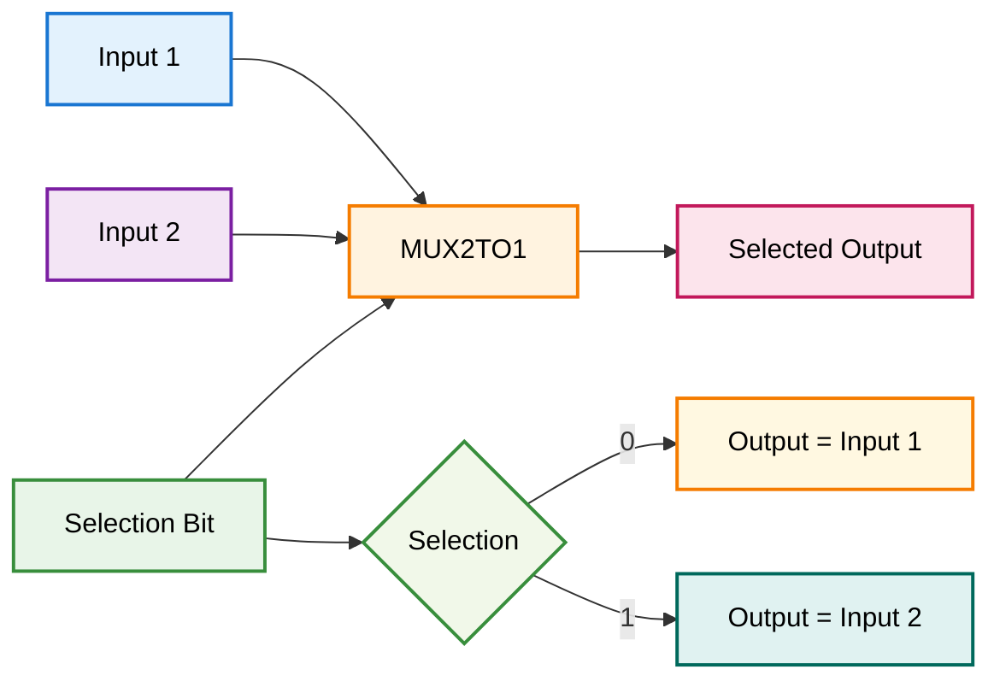

#### Aplicaciones del Multiplexor
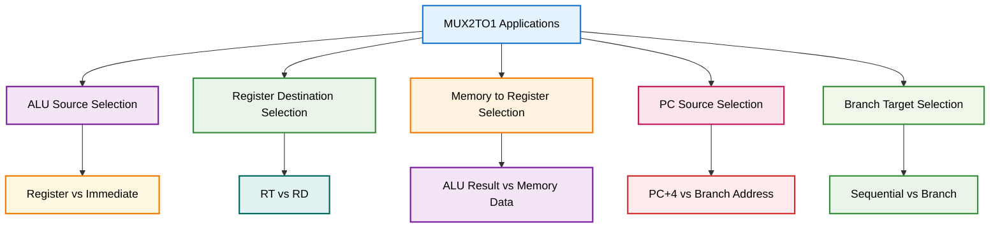

## Flujo de Datos en Operaciones

### Operación Aritmética Típica
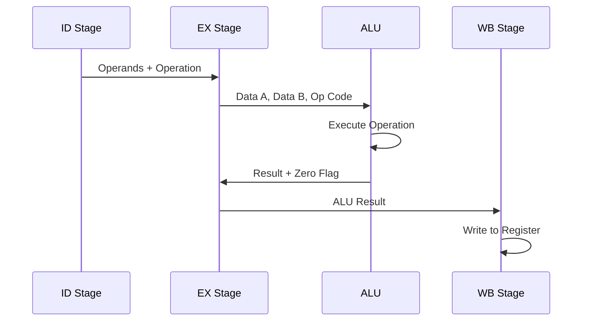

### Operación de Desplazamiento
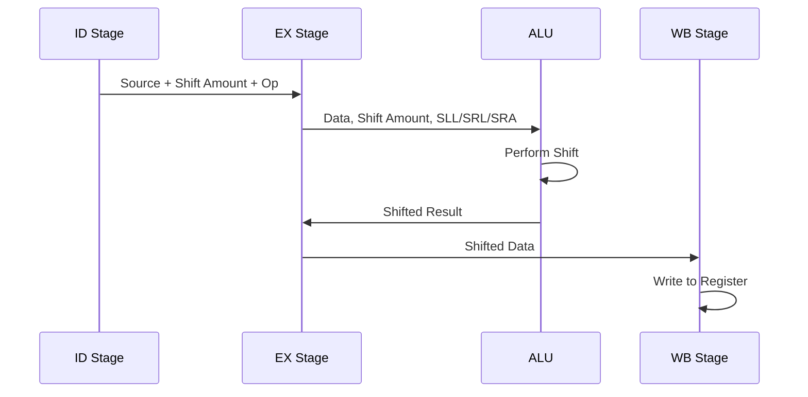

### Operación de Comparación
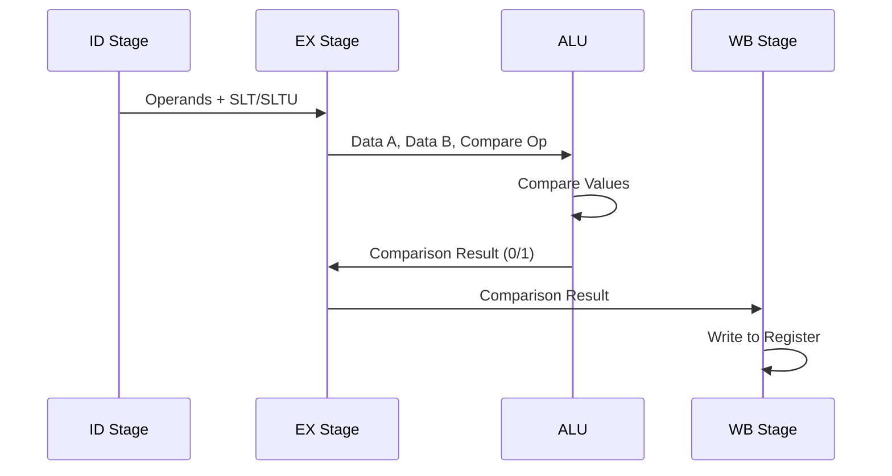

## Optimizaciones Implementadas

### 1. ALU Optimizada
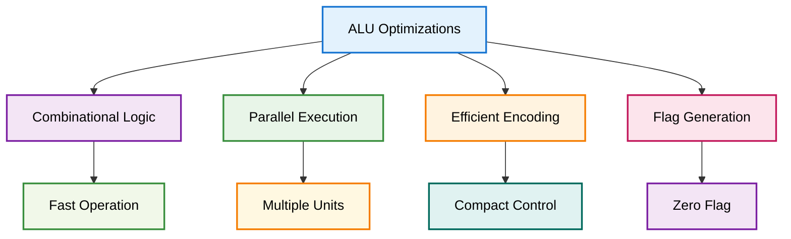

### 2. Multiplexor Eficiente
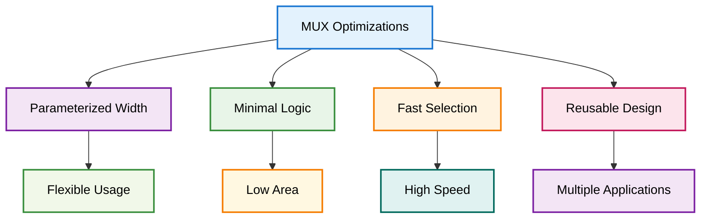

## Casos de Uso Específicos

### 1. Forwarding con Multiplexores
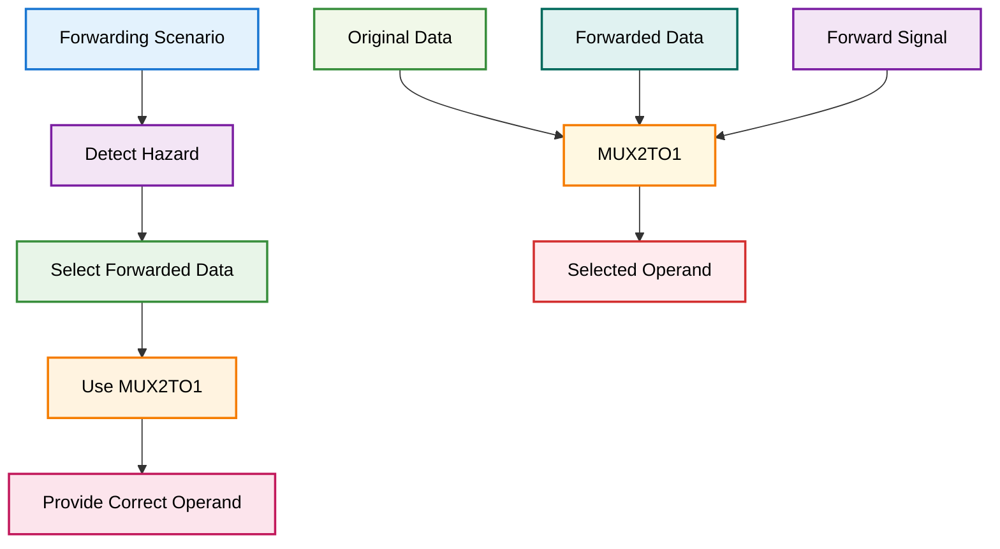

### 2. Control de Hazards
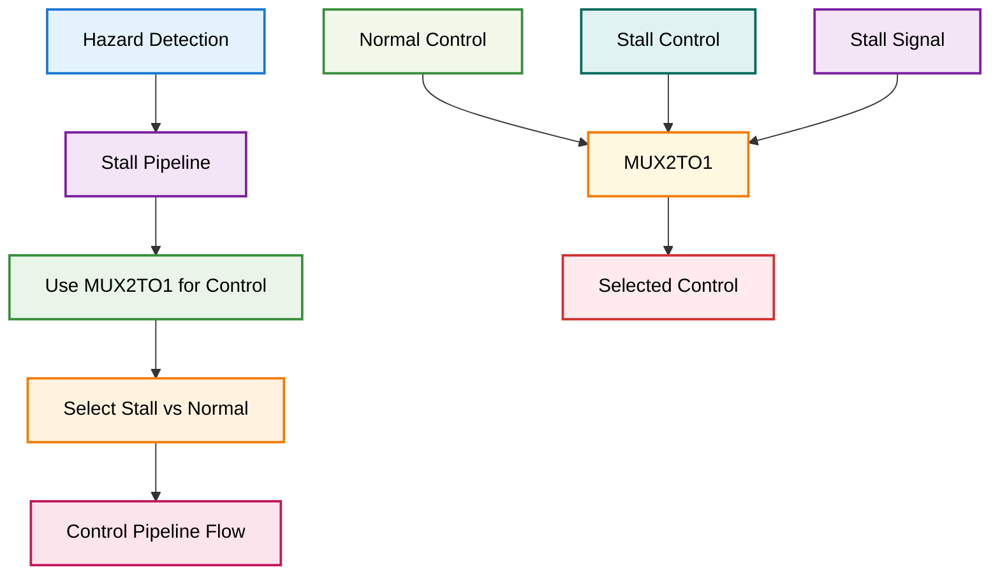

## Integración con el Pipeline

### Conexiones con Etapas
```mermaid
graph TD
    A[Utility Modules] --> B[IF Stage<br/>PC Control]
    A --> C[ID Stage<br/>Hazard Detection]
    A --> D[EX Stage<br/>ALU Operations]
    A --> E[MEM Stage<br/>Address Calculation]
    A --> F[WB Stage<br/>Data Selection]
    
    G[ALU] --> H[Execute Operations]
    I[MUX2TO1] --> J[Data Selection]
    K[ALU_CONTROL] --> L[Operation Control]
    
    style A fill:#e3f2fd,stroke:#1976d2,stroke-width:2px,color:#000
    style B fill:#f3e5f5,stroke:#7b1fa2,stroke-width:2px,color:#000
    style C fill:#e8f5e8,stroke:#388e3c,stroke-width:2px,color:#000
    style D fill:#fff3e0,stroke:#f57c00,stroke-width:2px,color:#000
    style E fill:#fce4ec,stroke:#c2185b,stroke-width:2px,color:#000
    style F fill:#f1f8e9,stroke:#388e3c,stroke-width:2px,color:#000
    style G fill:#fff8e1,stroke:#f57c00,stroke-width:2px,color:#000
    style H fill:#e0f2f1,stroke:#00695c,stroke-width:2px,color:#000
    style I fill:#f3e5f5,stroke:#7b1fa2,stroke-width:2px,color:#000
    style J fill:#ffebee,stroke:#d32f2f,stroke-width:2px,color:#000
    style K fill:#e8f5e8,stroke:#388e3c,stroke-width:2px,color:#000
    style L fill:#fff3e0,stroke:#f57c00,stroke-width:2px,color:#000
```

## Archivos Relacionados

- `ALU.v`: Unidad Aritmético-Lógica
- `MUX2TO1.v`: Multiplexor 2:1 genérico
- `testbenchs/`: Testbenches para verificación 